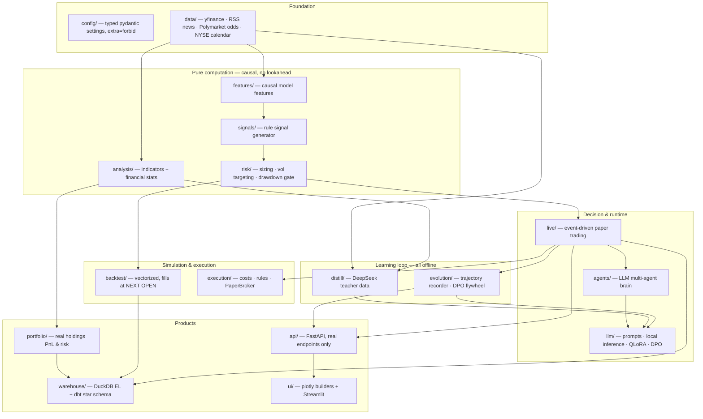
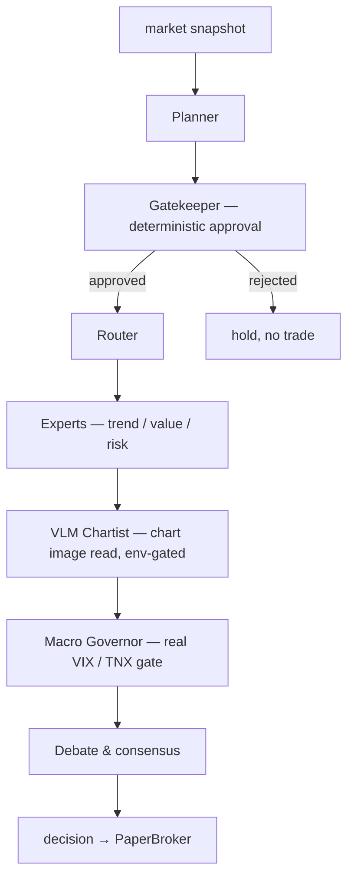
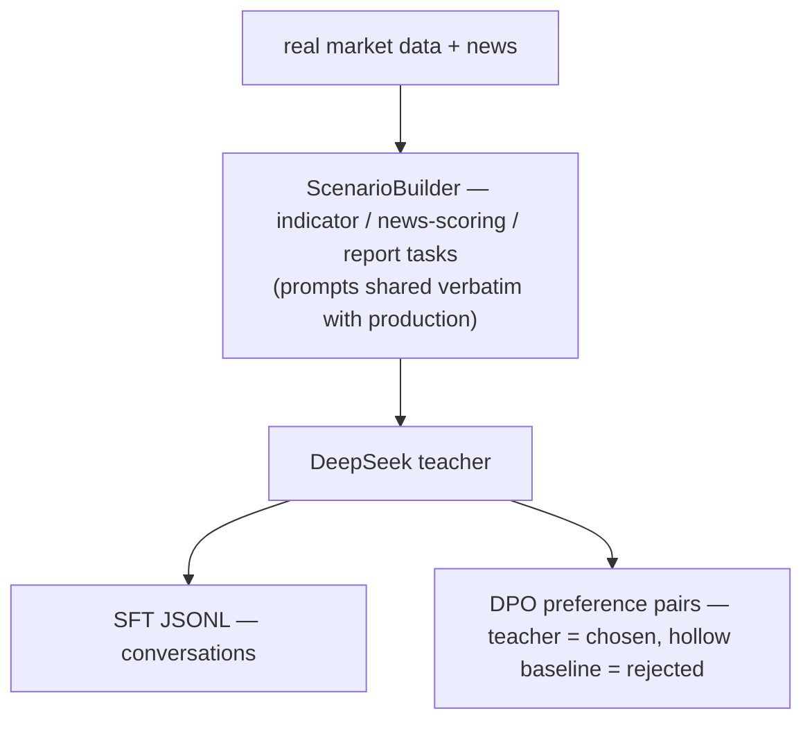
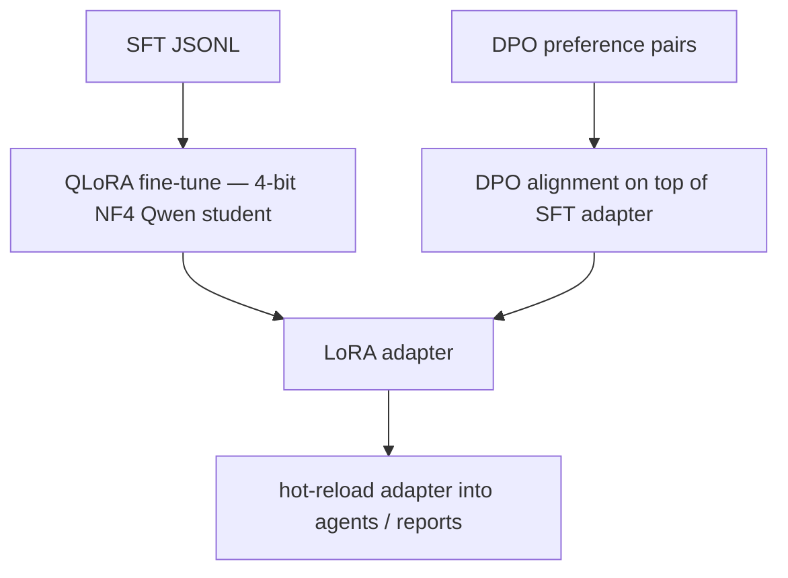
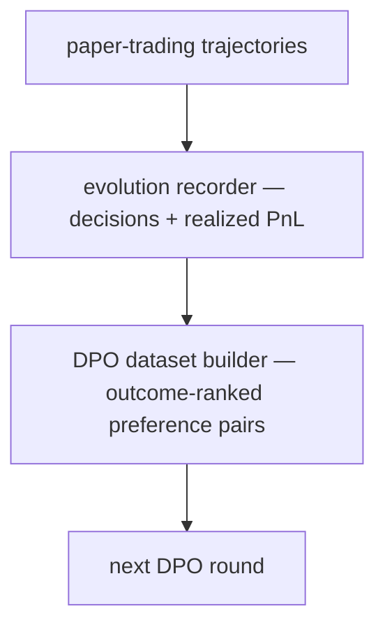
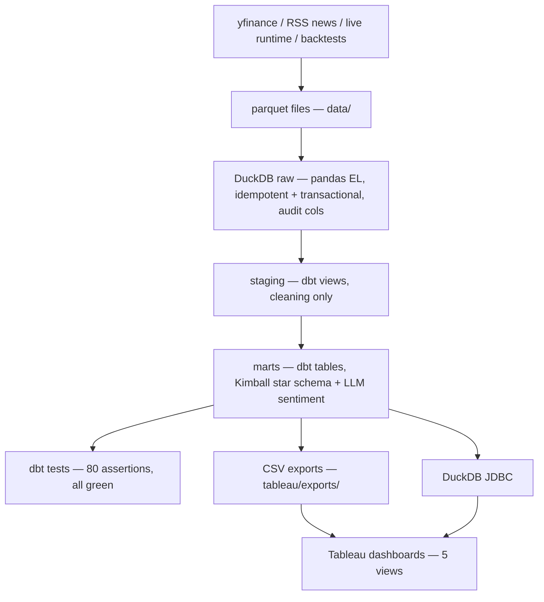

# QuantAI — Personal Portfolio Analysis & Decision-Support System

> Analyze real holdings, individual tickers, and strategy backtests with a clean,
> tested Python stack: technical-indicator + financial-statistics engine, a local
> data warehouse (DuckDB + dbt star schema) feeding Tableau, an LLM multi-agent
> layer with an offline teacher-student distillation pipeline, and a professional
> dark-theme dashboard. US equities (NYSE calendar), honest by design.

The codebase was rebuilt bottom-up into the typed, tested `quantai/` package
(700+ tests). Legacy code stays in `src/` untouched.

---

## What it does

Four jobs, nothing decorative:

1. **Analyze your real portfolio** — load actual holdings (local YAML/CSV, never
   committed), compute precise unrealized PnL, exposure/concentration, beta,
   holdings-based risk stats, and per-position technical state.
2. **Track tickers & markets** — a pure pandas/numpy indicator & stats engine with
   math definitions, boundary honesty, and causality proofs (no lookahead); a
   self-managed watchlist feeding prices, signals, and RSS news into the warehouse;
   a broker-style workstation UI (bilingual zh/en chrome, auto-refreshing intraday
   1-minute bars, VWAP, indicator toggles) with a real-position banner and an
   always-on **tactics board**: a five-factor rule engine emits per-symbol action
   cards (add/hold/trim/exit + stop references) every 30s, while a resident
   analyst — the local v2 student, or any OpenAI-compatible remote API via
   `llm.remote` — runs a background daemon thread that summarizes the board and
   persists news sentiment every 5 minutes without ever blocking the UI.
3. **AI analyst** — scheduled daily and intraday reports: session statistics with
   honest OHLCV-level selling-pressure proxies (down-bar volume share, price vs
   session VWAP, volume vs 20-day average), LLM commentary from a locally served
   Qwen model grounded strictly in system data, and batch **news-sentiment
   quantification** persisted to the warehouse for BI timelines.
4. **Decision support & learning loop** — rule + LLM multi-agent pipeline (planner →
   gatekeeper → router → experts → VLM chartist → macro governor → debate),
   paper-trading runtime, and an executed **teacher–student distillation flywheel**:
   DeepSeek-generated scenario batches (indicator analysis, news scoring,
   multi-symbol reports — prompts shared verbatim with production) → local
   QLoRA SFT / DPO on a single RTX 4090. The **v2 student is live**: 1,129
   teacher samples sampled across 25 historical dates (bull/bear/chop coverage),
   QLoRA-trained in 26 minutes (eval-loss 0.957), passed the blind-eval gate —
   zero repetition collapse and more prompt-number citations than the base model
   in 12/14 held-out + never-seen-symbol cases — and now serves as the
   production analyst adapter (v1 was rejected by the same gate and never
   shipped). On top of the batch flywheel, a scheduled
   **daily decision journal** accumulates triple-labeled samples every trading day:
   a transparent rule engine states the day's position call (citing real indicator
   values) → the teacher independently answers the same scenario (clean SFT data)
   and grades the system's call 0-10 (preference signal; low-scoring calls become
   DPO rejected samples) → realized 5/20-day forward returns are backfilled once
   the market plays out (ground truth for outcome-ranked DPO, never in prompts).

## Quick start

```powershell
# 0) All tests (fastest proof everything runs)
python -m pytest

# 1) Analyze your real portfolio (copy portfolio.example.yaml -> portfolio.local.yaml first)
python scripts/analyze.py                      # text report; --json for machines

# 2) Data warehouse: ETL -> dbt star schema -> Tableau-ready exports
python scripts/warehouse.py --full --portfolio portfolio.local.yaml

# 3) Dashboard (portfolio page works standalone)
python -m streamlit run quantai/ui/streamlit_app.py

# 4) AI analyst reports (data brief is seconds; --llm adds local-GPU commentary + news scoring)
python scripts/report.py --llm              # daily
python scripts/report.py --intraday --llm   # intraday session stats + selling-pressure proxies

# 5) Paper trading (offline deterministic demo)
python scripts/live.py --source simulated --tickers NVDA TSLA --interval 0.1 --duration 8 --seed 1

# 6) Distillation flywheel (mock dry-run is free; real teacher runs are cost-gated)
python scripts/distill.py --dry-run --symbols SPY NVDA
python scripts/train.py --sft data/distill/<batch>.jsonl --confirm-compute

# 7) Daily decision journal (rule engine call -> teacher answer + 0-10 grade -> training asset;
#    idempotent per scenario, outcome returns backfilled as they mature)
python scripts/journal.py --dry-run --symbols SPY NVDA
python scripts/journal.py --backfill-outcomes --export-sft data/distill/journal_sft.jsonl
```

## Architecture



### Multi-agent decision chain



Every LLM stage has a deterministic fallback, so the chain runs end-to-end
offline (CPU-only, no keys) and stays testable.

### Teacher-student distillation & evolution flywheel (offline by design)

**Stage 1 — Distillation** (cost-gated: real teacher calls require
`--run --confirm-spend`, key from env only):



**Stage 2 — Student training** (local RTX 4090, `--confirm-compute` gated):



**Stage 3 — Evolution flywheel** (paper-trading experience feeds the next round):



> **Honest boundary:** there are NO online gradient updates — all learning is
> offline batch training; `online_gradient_step()` raises `NotImplementedError`
> by design.

## Data stack (DA/DE-grade, not a sticker)



- **DuckDB** local warehouse, three schemas: `raw` (pandas extract-load, audit
  columns, idempotent re-runs) → `staging` (dbt views, cleaning only) → `marts`
  (dbt tables, Kimball star schema).
- **Star schema**: `dim_symbol`, `dim_date` (calendar spine + NYSE trading-day
  attrs) and facts with declared grains — `fact_prices` (window-function
  daily returns, 52-week-high distance), `fact_positions` (lot aggregation +
  ASOF-join valuation), `fact_trades`, `fact_signals`, `fact_news` (RSS
  headlines at link grain **with LLM sentiment columns** — unscored stays NULL,
  never a fake neutral 0), `fact_event_odds` (**Polymarket prediction-market
  implied probabilities** via the public Gamma API — Fed decisions, macro events —
  snapshotted daily into a probability time series), `fact_backtest_results`,
  `fact_backtest_equity` (SQL drawdown).
- **dbt tests**: 89 assertions (not-null/enums/relationships/grain uniqueness on
  every fact/OHLC sanity/PnL consistency/drawdown ≤ 0/warn on unpriceable
  positions) — all passing on real market data.
- **Reconciliation**: pytest runs a real `dbt build` and asserts SQL and pandas
  compute identical numbers (PnL to 1e-6, returns/drawdown to 1e-12).
- **Tableau**: connect via exported CSVs or DuckDB JDBC; build per
  [tableau/DASHBOARD_SPEC.md](tableau/DASHBOARD_SPEC.md).

## Integrity notes (deliberate, tested)

- Backtest fills at **next open**: the legacy same-bar-close fill inflated returns
  ~3.5×; the fix is the default and the old mode exists only for comparison.
  Honest benchmark: the demo strategy **underperforms** buy-and-hold SPY on CAGR
  (9.7% vs 14.2%) with shallower drawdown (-21% vs -34%) — sold as engineering +
  risk control, not alpha.
- Indicators propagate NaN through data holes instead of carrying stale values;
  MACD cross suppresses seed-artifact warmup signals; every boundary convention
  is documented at the function and pinned by tests.
- No fabricated UI panels; missing data renders as an explicit empty state.
- Online gradient updates are **not implemented** — the "evolution" loop is
  honest offline DPO, and the placeholder raises if called.
- Real API spend (DeepSeek distillation) requires an explicit
  `--run --confirm-spend` and an env-var key; CI and tests are mock-only.
- Student adapters ship only through a blind-eval gate
  (`scripts/eval_student.py`: base vs student side-by-side on held-out dates
  plus never-trained symbols, with repetition/citation/format collapse
  detectors) — the v1 adapter failed it and was never mounted.

## UI languages

The dashboard chrome (navigation, workstation, tactics board, paper-trading,
AI-analyst page) switches between 中文 and English from the sidebar; the
resident analyst answers in the selected language. Report *bodies* (daily /
intraday archives) and the portfolio/watchlist page internals are still
Chinese-first — honest boundary, on the roadmap.

## Privacy

Real holdings (`portfolio.local.yaml`, any `*.local.yaml`), `.env` secrets, and
generated data live outside version control via `.gitignore`. The repo ships
only `portfolio.example.yaml`.

## Requirements

Python ≥ 3.10. Core: numpy, pandas, pyarrow, scipy, ta, yfinance,
pandas_market_calendars, pydantic, duckdb. Extras: `[llm]` torch/transformers/
peft/trl, `[serve]` fastapi/uvicorn, `[ui]` streamlit/plotly/mplfinance,
`[warehouse]` dbt-duckdb. See [pyproject.toml](pyproject.toml).
