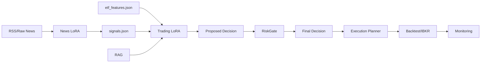

# QuantAI 工程日志
 
> 本文档记录项目从 Phase 1 到 Phase 15 的完整工程历程，包括问题诊断、技术决策、实现方案、产物清单与未来规划。
>
> **安全原则**：任何 API Key/Token 不得写入仓库，只允许通过环境变量或本地 `.env.local`（已在 `.gitignore` 忽略）管理。

---

## 里程碑总览

| Phase | 名称 | 状态 | 完成时间 |
|-------|------|------|----------|
| 1 | Bulletproof JSON Pipeline | 完成 | 2025-12 |
| 2 | Teacher 数据生成 (CN/US) | 完成 | 2025-12 |
| 3 | LLM 微调 (News LoRA) | 完成 | 2025-12 |
| 4 | 生产流水线 (日更自动化) | 完成 | 2025-12 |
| 5 | ETF Trader + RAG + RiskGate | 完成 | 2025-12-17 |
| 6 | Stock Trader v1.1（Tech + News）+ 双塔接线 | 完成 | 2025-12-18 |
| 7 | Simulation / Backtest（NAV Backtest + Execution Tuning） | 完成 | 2025-12-19 |
| 8 | Paper Trading Automation | 完成 | 2025-12-19 |
| 9 | Dashboard（Streamlit Cockpit） | 完成 | 2025-12-19 |
| 10 | CoT 蒸馏 / Reasoning 升级（Trader v2） | 完成 | 2025-12 |
| 11 | Adapter-MoE / Multi-Agent | 完成 | 2025-12 |
| 12 | DPO / GRPO | 完成 | 2025-12 |
| 13 | 黄金运行（严格风险 + 规划器 + DPO Analyst） | 完成 | 2025-12 |
| 14 | 评测平台（Protocol Freeze + Walk-forward + Stratified Report） | 进行中 | 2025-12 |
| 15 | Q4 Walk-forward 报告 + Alpha Mining + Surgical DPO（Analyst Alpha Hunter） | 进行中 | 2025-12 |

---

## 目录

- [里程碑总览](#里程碑总览)
- [Phase 1-2: JSON Pipeline + Teacher 数据](#1-目标与范围)
- [Phase 3: LLM 微调](#9-phase-3实战化-production-pipelinenight-ops-2025-12-14)
- [Phase 4: 生产流水线](#10-phase-4对答案backtestingevaluation-2025-12-14)
- [Phase 5: ETF Trader + RAG + RiskGate](#16-phase-54ragriskg闭环准备25k-数据--回测--发射按钮2025-12-15)
- [Phase 6: Stock Trader v1.1（Tech + News）执行记录](#1916-phase-62-里程碑历史-signals-回放backfill与训练集注入injection完成-2025-12-18)
- [Phase 7: Simulation / Backtest（2025-12）执行计划](#1920-phase-7-执行计划2025-12-月度-simulation--backtest-2025-12-19)
- [Phase 8: 架构演进路线图](#19-架构演进路线图2024-12-16-记录)
- [Phase 10: CoT 蒸馏 / Reasoning 升级（Trader v2）](#2025-12-19-phase-10-prototype-cot-蒸馏--reasoning-升级trader-v2)
- [Phase 11: Adapter-MoE / Multi-Agent](#phase-111-adapter-moe-router-heuristic-rule-based)
- [Phase 12: DPO / GRPO](#phase-12-1–12-2-dpo-基础设施-少样本偏好修正analyst)
- [Phase 13: 黄金运行](#phase-13-黄金运行严格风险--规划器--dpo-analyst-终极2025-年-12-月)
- [Phase 14: 评测平台](#phase-14-评测平台protocol-freeze--walk-forward--stratified-report)
- [Phase 15: Q4 Walk-forward Report + Alpha Mining + Surgical DPO](#phase-15-q4-walk-forward-report--alpha-mining--surgical-dpoanalyst-alpha-hunter)

---

## 1. 目标与范围

- 目标：让 LLM 在 **A 股新闻理解与交易语义** 上具备“中国特色金融逻辑”，能正确解读诸如“新质生产力 / 化债 / 国家队 / 立案调查 / ST / 重大资产重组 / 概念炒作”等语境，并稳定输出结构化标签。
- 当前阶段聚焦：
  - Phase 1：工程侧“止血”，保证 **严格 JSON 输出的可解析率**（批处理不中断）。
  - Phase 2：用 teacher 模型生成高质量训练数据，“重训大脑”，注入 A 股 event_type 与方向约束。

## 2. Phase 1：Bulletproof JSON Pipeline（止血）

### 2.1 典型故障模式

- LLM 输出 JSON 时，字符串里夹带未转义的 `"`，导致整体 JSON 解析失败。
- 批量评测/生成时，单条失败会中断 batch，影响迭代效率。

### 2.2 结论与工程策略

- 输入侧清洗：把输入文本中的双引号 `"` 替换成单引号 `'`，从源头降低 JSON 被破坏概率。
- 系统提示强约束：
  - 明确要求输出 **STRICT JSON only**。
  - 明确要求字符串值内部禁止出现双引号（使用单引号替代）。
- 输出侧兜底：
  - 从输出中提取第一个 JSON 对象。
  - 解析失败时尝试 `json_repair`/正则修复。
  - Fail-safe：单条失败记录错误，不中断 batch。

### 2.3 产物与脚本

- `scripts/infer_llm.py`
  - 新闻任务 prompt 强化 + 输入引号清洗。
- `scripts/eval_news_json.py`
  - 单条评测：输入清洗 + 强 prompt + 输出修复。
- `scripts/eval_news_json_batch.py`
  - 批量评测：模型只加载一次；单条 fail-safe；统计解析率。
- `.gitignore`
  - 已忽略 `/scripts/eval_outputs/` 与 `/scripts/eval_results/`，防止评测产物污染仓库。

## 3. A 股专属标签体系（粗粒度 event_type）

为了快速对齐“能用”的中国市场结构化理解，先采用粗粒度枚举：

- `policy_stimulus`
- `regulation_crackdown`
- `market_intervention`
- `concept_hype`
- `corporate_restructuring`

设计原则：

- 先把 **事件类型识别** 与 **方向（impact）** 做稳定，再逐步细化子类。
- A 股常见“黑话”优先：国家队、救市、窗口指导、立案调查/行政处罚、ST、化债、并购重组/借壳、题材炒作。

## 4. Phase 2：Teacher 选型与数据生成

### 4.1 Teacher 选型结论

- 最终选型：**DeepSeek-V3（`deepseek-chat`）**
- 理由：
  - 对 A 股政策隐喻/黑话理解更原生（如“化债”更贴近地方政府隐性债务置换语境）。
  - 成本低，适合批量生成。
  - 指令遵循好，配合 JSON 兜底策略更稳。
- 不选：`deepseek-reasoner`（R1）
  - 可能输出思考过程，干扰 strict JSON。

### 4.2 Teacher 生成脚本

- `scripts/generate_phase2_teacher_dataset.py`
  - OpenAI-compatible `/v1/chat/completions` 调用方式。
  - 已支持 `TEACHER_BASE_URL=https://api.deepseek.com`（会自动补 `/v1`）。
  - 输入：新闻 list（每条包含 `title/content/published_at`）。
  - 输出：可直接用于 LoRA 微调的 `conversations` JSON list。

### 4.3 A 股强制规则（生成后再二次 enforce）

为保证“方向不跑偏”，对 teacher 结果做硬约束：

- `policy_stimulus` => `impact_equity=+1` 且 `impact_bond=+1`
- `regulation_crackdown` => `impact_equity=-1`
- `market_intervention` => `impact_equity=+1`
- `concept_hype` => `impact_equity=+1`（summary 强制提到“炒作/短期/投机”语义）
- `corporate_restructuring` => `impact_equity=+1`

说明：这是一种“先保方向正确”的工程折中；后续可引入 `impact_confidence` 或更细分的结构来缓解过强先验。

## 5. 数据与评测体系

### 5.1 数据配比

- 目标：CN 400 + US 600（US:CN = 60:40）。

### 5.2 固定评测集与指标（规划）

- 建议固定评测集：50-200 条（覆盖：政策/概念/监管/国家队/重组/黑天鹅）。
- 指标：
  - JSON 可解析率（含修复后）
  - 字段缺失率/额外字段率
  - event_type 命中率（人工 spot check）
  - impact 方向一致性（对政策/监管/救市等强信号）

## 6. 安全与密钥管理

- 任何 API Key 不进入仓库、不进入脚本参数默认值。
- 推荐使用：
  - 环境变量：`TEACHER_API_KEY / TEACHER_BASE_URL / TEACHER_MODEL`
  - 或本地 `.env.local`（已加入 `.gitignore`）
- 如果密钥出现在聊天/日志/截图中，应视为泄露并立即作废。

## 7. 后续路线图（高优先级）

- 生成 CN 400 teacher 数据并做 QC：统计 OK/FAIL、解析率、缺失/额外字段分布。
- 补齐 US 600 teacher 或现有 US 数据源，形成 LoRA-C 训练集。
- 去重与评测 harness：避免模板化导致 hash 碰撞；建立稳定评测与一致性指标。
- 扩展新闻数据入口：RSS + 公开历史数据集（避免版权风险）。
- 回测/策略最小闭环：信号→仓位→交易规则→绩效，确保无未来函数。
- 存储预算：控制 checkpoints 数量，仅保留必要 LoRA 权重。

## 8. 每日工程记录（2025-12-14）

### 8.1 当日目标

- 目标 1：生成 CN400 teacher 数据集（DeepSeek-V3 / `deepseek-chat`），确保 strict JSON 可解析与字段稳定。
- 目标 2：补齐“数据管道可靠性”证据：QC 指标、后处理清洗、可复现脚本与工程日志。
- 目标 3：为 LoRA-C（US+CN 混合）训练准备可训练数据文件与训练入口命令。

### 8.2 关键决策与原因

- 决策：使用本地 `.env.local` 管理 `TEACHER_*` 配置（并保持 `.gitignore` 忽略）。
  - 原因：避免在命令行参数/仓库文件中暴露密钥；同时支持 IDE 内直接复现运行。
  - 备注：IDE 对被 `.gitignore` 命中的文件存在访问限制，因此采用“仓库内 `env.local.example` 模板 + 本地复制为 `.env.local`”的双文件策略。

- 决策：teacher 生成完成后，增加“可训练化后处理”步骤。
  - 原因：teacher 输出存在 `sentiment` 类型混用（数字与字符串并存）与少量 `impact_bond` 异常值，会降低微调稳定性。
  - 策略：不重跑 teacher，直接对输出做本地后处理，生成 clean 版本。

- 决策：混合数据集构建使用可复现采样（seed 固定）。
  - 原因：当前 US 训练集规模不足预期（本地现存 `train.json` 为 284），为了先启动 LoRA-C 验证 Phase 2 假设，采用有放回采样补足到 target=1000，同时保留可追溯性。

### 8.3 当日实现与产物

- CN 新闻抓取扩展：
  - `scripts/fetch_cn_news.py` 增加分页抓取能力，最终生成 `data/cn_news_400.json`（400 条）。

- CN400 teacher 生成：
  - `scripts/generate_phase2_teacher_dataset.py` 支持 DeepSeek base_url 规范化（自动补 `/v1`）。
  - 运行结果：`data/finetune/phase2_cn_teacher.json` items=400。

- QC（原始 teacher 输出）：
  - `parse_ok=400, parse_fail=0`
  - `missing={}`，`extra={}`
  - `event_type` 分布：concept_hype 137 / corporate_restructuring 100 / policy_stimulus 78 / regulation_crackdown 60 / market_intervention 25
  - 发现：`sentiment` 混用（如 `negative/neutral/positive` 与 `-1/0/1` 并存）；`impact_bond` 存在少量非预期值。

- 后处理 clean 版本：
  - 产出：`data/finetune/phase2_cn_teacher_clean.json`
  - 处理：
    - `sentiment` 归一到 `-1/0/1`
    - `impact_bond` 规则化：仅 `policy_stimulus=1`，其余置 `0`

- 脚本入库（可复现证据）：
  - `scripts/qc_phase2_cn_teacher.py`
  - `scripts/postprocess_phase2_cn_teacher.py`
  - `scripts/build_phase2_hybrid_dataset.py`（US+CN 目标 1000、US:CN=60:40、seed 固定、可选 shuffle）

### 8.4 当前状态与下一步

- 训练数据：
  - 推荐训练输入使用 `data/finetune/phase2_hybrid_1000.json`（由脚本生成，target=1000，US:CN=60:40）。
  - CN 侧使用 clean 版本：`data/finetune/phase2_cn_teacher_clean.json`。

- 下一步（进入“炼丹”）：
  - 使用 `scripts/finetune_llm.py` 启动 LoRA-C（Qwen2.5-14B + QLoRA + grad checkpointing）。
  - 训练后用固定 A 股 5-case 回归评测：检查 `event_type` 与 impact 强绑定是否符合预期。

- 安全：
  - 若密钥曾出现在聊天/文本中，应视为泄露并尽快作废，后续仅使用本地 `.env.local` 或环境变量。

### 8.5 LoRA-C 微调实测记录（Hybrid 1000, 2025-12-14）

- 训练输入：`data/finetune/phase2_hybrid_1000.json`（1000 条，US:CN=60:40）
- 训练命令（不含密钥）：

```powershell
.\venv311\Scripts\python.exe scripts\finetune_llm.py `
  --model Qwen/Qwen2.5-14B-Instruct `
  --data data\finetune\phase2_hybrid_1000.json `
  --qlora --grad-ckpt --max-seq-len 1024 `
  --batch-size 1 --grad-acc 16 `
  --lr 1e-4 --epochs 3 `
  --save-steps 50 --save-total-limit 5 `
  --outdir models\llm_qwen14b_lora_c_hybrid `
  --resume auto
```

- 训练结果摘要：
  - `train_runtime`: 3477.8323s（约 58min）
  - steps: 189（`18.40s/it`）
  - 末段 loss（log）：0.5997 → 0.5967
  - `train_loss`（全程均值）：0.9075121551594406
  - 保存路径：`models\llm_qwen14b_lora_c_hybrid\lora_weights`

### 8.6 训练后回归评测：CN5 + US5（Base vs LoRA, 2025-12-14）

回归集（合成文本，避免版权风险）：`docs/phase2_regression_cases_cn5_us5.json`。

评测工具：`scripts/infer_llm.py`（支持 `--cases` 批量推理与 `--compare-lora` Base vs LoRA 对比，并打印 `JSON_PARSE_OK_RATE`）。

#### 8.6.1 JSON 可解析率

- CN 5-case：
  - Base：5/5 OK
  - LoRA：5/5 OK
- US 5-case：
  - Base：5/5 OK
  - LoRA：5/5 OK

结论：Phase 1 的“strict JSON + 输入清洗”链路在 LoRA 后仍保持稳定。

#### 8.6.2 CN 侧对齐效果（方向与枚举）

- `policy_stimulus`（稳增长/专项债）：
  - LoRA 输出更贴近硬规则（`impact_bond=1`），方向一致。
- `regulation_crackdown`（立案调查/监管措施）：
  - Base 与 LoRA 均稳定输出 `impact_equity=-1`。
- `market_intervention`（维稳/长期资金入市）：
  - Base 倾向输出 `market_intervention`（符合预期）。
  - LoRA 有一次将其归类为 `policy_stimulus`，并给出 `impact_bond=1`。

结论：LoRA 在“政策刺激”与“维稳干预”的边界上存在混淆；需要通过更明确的提示词约束/更多对比样本来区分。

#### 8.6.3 US 侧漂移（最重要发现）

观察：LoRA 在多条 US 宏观 case 上开始输出中文侧 event_type（如 `policy_stimulus` / `policy_stable`），并倾向给出 `impact_equity=1`、`impact_bond=1` 的模式化结果。

风险：这意味着混合训练在当前规模下（US 284 + CN 400，且 CN 标签体系硬约束较强）可能造成“标签空间被 CN 主导”，从而影响 US case 的结构化语义保持。

#### 8.6.4 下一步动作（建议优先级）

- A（高）：推理侧提示词“分市场枚举”
  - 对 US 明确 event_type enum（US 宏观/公司/风险等），避免模型自由迁移到 CN enum。
  - 对 CN 明确 `market_intervention` 与 `policy_stimulus` 的判别准则（例如：是否包含财政/货币具体工具 vs 仅稳定预期/资金入市表态）。

- B（高）：训练侧补充“反漂移锚点”
  - 增加 US 样本量或提升 US 训练权重（例如 US:CN=70:30 或扩增 US 到 600+）。
  - 或引入一个显式字段（如 `market`）并在训练样本中固定输出（让模型先判别市场，再判别 event_type）。

- C（中）：把回归集扩展为 20-case（CN10+US10），并纳入 nightly 回归。

#### 8.6.5 方向 A 验证结果：US 漂移已被推理侧隔离显著缓解

我们在 `scripts/infer_llm.py` 实施 Split Brain Strategy：

- 对 US：强制 US-only event_type enum（并显式禁止 CN enum）。
- 同时将 system prompt 强化为“标准 JSON（键/字符串必须使用双引号）”，避免单引号字符串导致 `json.loads` 失败。

验证（US 5-case，Base vs LoRA）：

- JSON 可解析率：
  - Base：从 4/5 修复到 5/5
  - LoRA：保持 5/5
- event_type 漂移：
  - LoRA 输出已回到 US enum（`fomc_decision` / `inflation_data` / `jobs_report` / `gdp_data` / `fiscal_tariff`），未再出现 `policy_stimulus` 等 CN enum。

剩余问题（待后续精修）：

- CN 侧 `market_intervention` vs `policy_stimulus` 边界仍存在一次混淆，需要在提示词中加入更明确判别准则或补充对比样本。

## 9. Phase 3：实战化 Production Pipeline（Night Ops, 2025-12-14）

目标：搭起“每日自动选股/风控”的骨架（自动抓新闻 → 自动推理 → 自动出日报）。

### 9.1 Step 1 - The Eyes（RSS 数据获取）

工程决策：

- 不覆盖现有 `config/sources.yaml` 结构。
  - 原因：仓库已有 `version/defaults/sources`（Fed/BEA/BLS/Yahoo 等），直接覆盖会破坏历史脚本与兼容性。
  - 方案：在文件末尾追加 Phase 3 专用字段 `us_sources` / `cn_sources`，让新脚本优先读取新字段，旧脚本仍可继续使用 `sources:`。

新增/更新产物：

- 配置扩展：`config/sources.yaml`
  - 追加 `us_sources`：CNBC、Investing、Yahoo Finance news index
  - 追加 `cn_sources`：Sina Finance、WallstreetCN

- 抓取脚本：`scripts/fetch_daily_rss.py`
  - 行为：抓取近 `--hours`（默认 26h）新闻，做去重与容错
  - 输出：`data/daily/news_YYYY-MM-DD.json`
  - 去重策略：`market + source + url + title` hash
  - 时间处理：尽量解析 `published_parsed/updated_parsed`，否则使用 RFC822 字符串，缺失时间戳的条目默认保留

运行方式：

```powershell
.\venv311\Scripts\python.exe scripts\fetch_daily_rss.py
```

### 9.2 下一步（Step 2/3 规划）

- Step 2 - The Brain：`scripts/run_daily_inference.py`
  - 输入：`data/daily/news_YYYY-MM-DD.json`
  - 加载：LoRA-C 权重（`models\llm_qwen14b_lora_c_hybrid\lora_weights`）
  - 输出：逐条结构化信号 JSON（包含 market + event_type + impacts + summary + url/source），并统计 JSON 解析成功率

- Step 3 - The Mouth：`scripts/generate_daily_report.py`
  - 输入：Step 2 的信号文件
  - 输出：Markdown/HTML 日报（分市场汇总、Top 正负面事件、风险提示、关注标的/板块）

### 9.3 Step 1 修复：CN RSS 被拦截（HTML/404/invalid token）→ API fallback

现象：

- Sina RSS / WallstreetCN RSS 在本地环境下返回 `text/html` / 404 / bozo invalid token，导致 CN entries=0。

处置：

- 在 `scripts/fetch_daily_rss.py` 增加 CN fallback（当 CN RSS 为 0 时自动启用）：
  - Sina roll JSON
  - Eastmoney 快讯
  - CLS 电报

结果：

- 近 26h 抓取总量：234（US=11, CN=223；CN 以 fallback 为主）

### 9.4 Step 2 实测：全量推理 + Split Brain 生效

运行：

```powershell
.\venv311\Scripts\python.exe scripts\run_daily_inference.py --date 2025-12-14 --use-lora --load-in-4bit
```

结果：

- parse_ok：234/234
- market counts：US=11, CN=223
- event_type（top）：
  - concept_hype: 91
  - regulation_crackdown: 63
  - corporate_restructuring: 32
  - policy_stimulus: 23
  - market_intervention: 14

备注：US/CN split-brain 枚举隔离在冒烟（US5+CN5）中验证有效，CN 分支可以稳定输出 CN enum。

### 9.5 Step 3 实测：Markdown 日报生成

运行：

```powershell
.\venv311\Scripts\python.exe scripts\generate_daily_report.py --date 2025-12-14
```

产物：

- `data/daily/report_2025-12-14.md`

### 9.6 工程问题：CN 文本乱码（mojibake）

现象：

- report 中出现类似 `鍗...` / `China鈥檚` 的错码字符（常见于 UTF-8 字节被错误按 GBK/GB18030 解码或反向）。

处置：

- 在抓取端 `scripts/fetch_daily_rss.py` 增加：
  - `resp.content` 显式解码（utf-8/utf-8-sig/gb18030 fallback）
  - 基于启发式 penalty 的 `mojibake repair`（gbk/gb18030 -> utf-8 回转）
- 在日报端 `scripts/generate_daily_report.py` 增加二次兜底 repair（防止上游残留错码）。

### 9.7 Step 2B：Batch 推理的“防爆阀”（OOM/尾部延迟防护）

问题背景：

- Batch 推理时，最长样本会决定整个 batch 的 token 长度与计算成本。
- 如果 RSS 抓入超长正文（例如财报全文/长文 3 万字），会带来：
  - 显存飙升（甚至 OOM）
  - tail latency（短新闻也被长新闻拖慢）

处置（工业级防护）：

- 在 `scripts/run_daily_inference.py` 增加输入侧字符级硬截断：
  - 参数：`--max-input-chars`（默认 6000）
  - 行为：在构建 prompt 前对 `content` 执行 `content[:max] + "...(truncated)"`
- 修复 batch decode 的边界：
  - 使用 `attention_mask.sum()` 得到 per-sample prompt 长度
  - decode 时按每条样本的 `prompt_len` 截断（而不是按 padding 后的统一长度），避免混入 prompt 残留影响 JSON 提取。

附加增强：

- 支持 `--batch-size` 提升吞吐
- 支持 `--resume` + `--save-every` 断点续跑与增量写盘（生产更稳）

### 9.8 压力测试（Stress Test）：核弹样本验证防爆阀生效

目的：

- 验证 `--max-input-chars` 能在极端长文本（5 万字级）下防止 batch OOM 与 tail latency。

步骤：

1) 生成压力测试数据（1 条 50k 字 monster + 7 条正常）：

```powershell
.\venv311\Scripts\python.exe -c "import json; normal='Short news.'; huge='CRASH ' * 10000; data=[{'title':f'News {i}', 'content': huge if i==0 else normal, 'source':'Test', 'market':'US', 'url':'http://test', 'published_at':'2025-12-14'} for i in range(8)]; json.dump(data, open('data/daily/stress_test.json','w'), indent=2); print('Created stress_test.json with 1 monster entry (50k chars).')"
```

2) Batch 推理点火（batch-size=8 + max-input-chars=6000）：

```powershell
.\venv311\Scripts\python.exe scripts/run_daily_inference.py \
  --model Qwen/Qwen2.5-14B-Instruct \
  --lora models/llm_qwen14b_lora_c_hybrid/lora_weights \
  --use-lora \
  --data data/daily/stress_test.json \
  --load-in-4bit \
  --batch-size 8 \
  --max-input-chars 6000 \
  --out data/daily/stress_result.json
```

验收结果（关键日志）：

- 截断证据：`Truncated content ... from 59999 to 6000 chars`
- 无 OOM / 无卡顿：推理顺利完成
- parse_ok：8/8
- 输出：`data/daily/stress_result.json`

---

**前置依赖**：[Phase 3](#9-phase-3实战化-production-pipelinenight-ops-2025-12-14) 已完成日更流水线

---

## 10. Phase 4：对答案（Backtesting/Evaluation, 2025-12-14）

目标：

- 将 LLM 的结构化信号（AI 预测方向）与行情数据（Ground Truth）对齐，计算胜率/覆盖率。

### 10.1 判卷脚本：`scripts/evaluate_signal.py`

输入：

- `data/daily/signals_YYYY-MM-DD.json`

Ground Truth 数据源（本地已有）：

- US：`data/raw/SPY.parquet`
- CN：`data/raw/510300.parquet`（沪深300 ETF 代理）

对齐策略（粗粒度、先跑通）：

- 默认使用 T+1（从新闻 `published_at` 的日期开始，向后找下一交易日的日收益）
- 为避免周末/节假日，向后查找窗口默认 7 天（可调）

对齐口径选项：

- `--align-mode published_at`（默认）：按每条新闻的 `published_at` 日期对齐。
  - 风险：若抓取来源混杂、或时区导致 `published_at` 跨日（例如同一批 signals 里出现 12-14/12-15），会导致样本分散且部分市场无法对齐。
- `--align-mode run_date`：强制把所有条目的对齐基准设为 signals 文件对应的 `--date`。
  - 用途：快速“对答案”首跑（把同一天信号集中对齐到 T+1），避免被 `published_at` 跨日影响样本量。

输出：

- 总体胜率（Accuracy）
- 分市场胜率（US/CN）
- 覆盖率/跳过数（因行情缺失导致无法对齐）

### 10.2 常见坑：行情数据滞后导致“全跳过”

现象：

- 若本地 parquet 的最后交易日早于 signals 的 pub_date+1，所有样本会被判定为无行情数据，从而全部 skipped。

脚本已增强诊断输出：

- 打印 US/CN 行情数据的 `last_return_date`
- 打印 signals 的 `pub_date range`

### 10.3 可选增强：自动补齐行情（需要联网）

为了让“判卷子”一键跑通，脚本提供 `--auto-fetch`：

- 会用现有 `DataFetcher` 拉取缺失日期区间并合并回 `data/raw/*.parquet`

示例（直接对 2025-12-14 signals 计算胜率）：

```powershell
.\venv311\Scripts\python.exe scripts\evaluate_signal.py --date 2025-12-14 --auto-fetch --fetch-source yfinance --sample 20
```

示例（使用 run_date 口径集中对齐）：

```powershell
.\venv311\Scripts\python.exe scripts\evaluate_signal.py --date 2025-12-14 --align-mode run_date --auto-fetch --fetch-source yfinance --sample 20
```

备注：

- `--auto-fetch` 会发起外部请求（yfinance/akshare），默认关闭。

### 10.4 工程问题：Beta 污染与按事件类型评估（Event-based Alpha Analysis）

背景：

- 若当日指数本身单边下跌/上涨（强 Beta），用“涨跌方向命中率”直接给新闻信号判卷，会把大量偏多/偏空的事件类型一刀切判错。

处置：

- 在 `scripts/evaluate_signal.py` 增加按 `event_type` 的分组统计（Total/Wins/Acc%），用来定位“哪类事件更接近 Alpha、哪类更像噪音”。

示例（2025-12-14 signals，以 `--align-mode run_date` 对齐到 2025-12-15；510300 当日 -0.15%）：

- `concept_hype`: 60 条，Acc 0.00%
- `policy_stimulus`: 11 条，Acc 0.00%
- `regulation_crackdown`: 15 条，Acc 100.00%
- `market_intervention`: 11 条，Acc 9.09%

### 10.5 评测“滤网”：按事件类型过滤（Risk-only 专场）

新增：

- `scripts/evaluate_signal.py` 增加 `--types`（逗号分隔），仅评测指定 `event_type`。

示例（仅评风控事件）：

```powershell
.\venv311\Scripts\python.exe scripts\evaluate_signal.py --signals data/daily/signals_full_2025-12-14.json --date 2025-12-14 --align-mode run_date --types regulation_crackdown
```

### 10.6 自动化积累：每日一键流水线（Windows）

背景：

- RSS 通常仅保留近 24h，无法天然回溯历史；因此需要从今天开始日更积累 signals + 评测数据。

新增：

- 根目录新增 `run_pipeline.bat`：一键执行 `fetch_daily_rss.py` → `run_daily_inference.py` → `generate_daily_report.py`。
- `TODAY` 由 Python 生成（避免 Windows 区域设置导致 `%date%` 切片不一致）。

## 11. 新闻模块运维：每日抓取健康检查（2025-12-15）

新增：

- `scripts/fetch_daily_rss.py` 增加 `--health-out`：输出抓取健康检查 JSON。
  - `--health-out auto`：写入 `data/daily/health_YYYY-MM-DD.json`

健康指标包含：

- `by_source[market:source]`：rss_entries / rss_in_window / rss_added / rss_errors / fallback_added
- `cn`：rss_items / fallback_used / fallback_candidates / fallback_added
- `totals`：rss_added / rss_errors / fallback_added / final_total

本地验证（2h 窗口）：

- CN RSS 0 条时自动启用 fallback，并写出 health 文件用于后续监控。

## 12. Phase 4 增强：多日聚合评测 + 风控专栏（2025-12-15）

新增：

- `scripts/evaluate_signal.py` 支持 `--scan-daily`：扫描 `data/daily/signals_*.json`（含 `signals_full_*.json`）并输出跨日汇总统计。
- `scripts/generate_daily_report.py` 增加 `Risk Watch (CN: regulation_crackdown)` 专栏：统计数量/占比并列出 Top 条目。

## 13. Phase 5（A/A）：ETF 特征快照 + 日更接入（2025-12-15）

目标：

- 让后续 LLM 学会在 ETF/指数层面结合技术面与风险状态输出仓位/风控建议（先做结构化特征与 teacher 产物，再蒸馏微调）。

新增：

- `scripts/build_daily_etf_features.py`
  - 输入：`data/raw/*.parquet`
  - 输出：`data/daily/etf_features_YYYY-MM-DD.json`
  - 内容：技术指标（MA/动量/波动/回撤等）+ 市场 Regime（SPY/VIX 可选）+ teacher 目标仓位（含 risk_profile 约束）。

接入：

- `run_pipeline.bat` 增加一步生成 ETF 特征快照（在 fetch 与 LLM 推理之间）。
- `scripts/generate_daily_report.py` 增加 `ETF Feature Summary`（若特征文件存在则展示）。

## 14. Phase 5.2：豪华版 Teacher 蒸馏（DeepSeek → Qwen，2025-12-15）

目标：

- 用 DeepSeek 作为 Teacher 对 ETF 特征快照进行“多角色推演 + 综合”，生成高质量蒸馏样本（适配后续 LoRA 训练）。

新增：

- `scripts/generate_etf_teacher_dataset.py`
  - 输入：`data/daily/etf_features_YYYY-MM-DD.json`（按日期区间扫描）
  - 可选：读取同日 `data/daily/signals_YYYY-MM-DD.json`，提取 `regulation_crackdown` 风控摘要作为上下文
  - 输出：`data/finetune/teacher_etf/teacher_etf.jsonl`（JSONL，支持追加）

输出格式（每行一个样本）：

- `output` 为单个 JSON 对象，包含：
  - `role_aggressive` / `role_risk` / `role_quant`
  - `synthesis`
  - `label`（action/target_position/risk_notes/rationale）

运维与安全阀：

- `--resume`：按样本 id 去重断点续跑
- `--max-output-tokens`：限制 teacher 输出长度（避免无穷烧钱）
- `--max-retries` + `--timeout`：失败重试与超时控制

配置：

- 通过 env 读取：`TEACHER_API_KEY` / `TEACHER_BASE_URL` / `TEACHER_MODEL`
  - DeepSeek OpenAI-compat 示例：`TEACHER_BASE_URL=https://api.deepseek.com`，`TEACHER_MODEL=deepseek-chat`

运行记录：

- 通过 `--variants` 支持同一（date,symbol）多视角多样本生成（用于“烧钱换质量”）。
- 以 `2025-12-14` 为例：7 个 ETF × 6 variants = 42 行 JSONL（`failed=0`）。
- Windows PowerShell 抽样解析注意：建议 `Get-Content ... -Encoding UTF8 | ConvertFrom-Json`，否则可能出现乱码导致解析失败。

## 15. Phase 5.3：Teacher 数据扩量（20k 级别，2025-12-15）

目标：

- 为过夜 QLoRA 蒸馏准备 20k 级别 teacher 样本（仅靠单日数据远远不够）。

新增/增强：

- `scripts/build_daily_etf_features.py`
  - 增加 `--start-date/--end-date`：按交易日批量生成 `etf_features_YYYY-MM-DD.json`
  - 批量模式以 SPY 交易日为基准日历（缺失则退化为全标的日期并集）
- `scripts/generate_etf_teacher_dataset.py`
  - 增加 `--workers`：并发调用 teacher API（否则 20k 顺序调用会超时）
  - 增加 `--cot-ratio`：抽样启用长推演（在成本与质量之间折中）

建议口径：

- 以 7 个 ETF、`variants=6` 为例：约 500 个交易日 ≈ 21k 样本（满足 20k 目标）。

样本配比（美股:大A=60:40）：

- 通过按市场分配 `variants` 实现：US ETF（SPY/QQQ/TLT/GLD）生成更多 variants，CN ETF（510xxx）生成较少 variants。

双模型架构（参谋长 vs 指挥官）：

- 新闻 LoRA（情报参谋）：将新闻噪音结构化为 `signals_*.json`（每日情报简报）。
- 交易模型/LoRA（现场指挥官）：综合 `signals_*.json`（risk_watch）与 `etf_features_*.json`（技术面/仓位目标），输出最终动作与目标仓位。

未来架构蓝图（planned，用于防偏离）：

- 证据/检索层（RAG）：检索新闻原文片段、宏观数据、历史相似案例，为决策提供证据。
- 风控裁决层（确定性）：硬约束最大仓位/回撤/杠杆/风格切换，把交易模型输出当作“建议”再裁决。
- 执行规划层：将目标仓位转成下单计划（阈值再平衡、分批、交易限制）。
- 评估与监控：回测、A/B、漂移监控、每日质量看板。
- 多 Adapter 管理：尽量维持一个 base，多套 LoRA（新闻/交易等），按任务路由。

## 16. Phase 5.4：RAG+RiskGate 闭环准备（25k 数据 + 回测 + 发射按钮，2025-12-15）

目标：

- 将 ETF teacher 蒸馏扩展到 2.5 万级别（带 RAG 历史 Top3 + 风控约束 trace）。
- 在数据生成进行时，提前准备好：
  - 可训练数据清洗/格式化脚本
  - 最终版微调命令（含验证集）
  - 实战推理脚本（复刻训练 prompt + RAG + 风控裁决）
  - 离线回测引擎骨架（验证策略输出的资金曲线）

### 16.1 风控与检索模块（确定性组件）

新增：

- `src/risk/gate.py`
  - 风控裁决 `RiskGate.adjudicate(features, news_signals, proposed_action, proposed_pos)`
  - 关键规则：
    - 最大回撤熔断（`drawdown_20d_pct < -8%` -> FORCE CLEAR）
    - 单品种仓位封顶（默认 0.5）
    - 关键事件黑名单触发减仓（如 `regulation_crackdown/war_breakout/...`）
    - 高波动惩罚（`volatility_ann_pct > 30%` -> scale down）

- `src/data/rag.py`
  - `MarketRAG`：基于 FAISS 的 ETF 历史相似日检索
  - 向量：`[change_5d_pct, volatility_ann_pct, drawdown_20d_pct]`
  - 关键防泄漏：检索时支持 `exclude_date` 排除同日样本

### 16.2 Teacher 数据生成：RAG + RiskGate prompt 注入

增强：

- `scripts/generate_etf_teacher_dataset.py`
  - 引入 `MarketRAG` 检索历史相似 Top3（写入 user prompt 的 `HISTORICAL_CONTEXT_TOP3`）
  - 引入 `RiskGate` 生成风险约束 trace（写入 `RISK_CONSTRAINTS_TRACE`）
  - `build_teacher_messages()` 统一构建 prompt（训练/推理将复用该函数）
  - 支持 `--dry-run`：打印 prompt 验证注入是否生效
  - 并发能力：`--workers N`
  - 断点续跑：`--resume`（按样本 id 去重）
  - 扩量停止条件：`--target-total 25000`

运行（2.5w 版本，建议后台运行并记录 log）：

```powershell
.\venv311\Scripts\python.exe scripts\generate_etf_teacher_dataset.py `
  --target-total 25000 `
  --workers 10 `
  --risk-watch-market BOTH `
  --risk-watch-top 3 `
  --start-date 2024-01-01 `
  --end-date 2025-12-14 `
  --out data/finetune/teacher_etf/teacher_etf_rag_enhanced_25000.jsonl `
  --resume
```

监控（0.1 秒刷新，追写入进度）：

```powershell
$log = "logs\teacher_rag_25000.err.log"
while ($true) {
  $line = Get-Content $log -Tail 1
  $m = [regex]::Match($line, 'written=(\d+)\s+failed=(\d+)\s+skipped=(\d+)')
  Clear-Host
  if ($m.Success) {
    $w = $m.Groups[1].Value; $f = $m.Groups[2].Value; $s = $m.Groups[3].Value
    $ts = Get-Date -Format "HH:mm:ss.fff"
    Write-Host "$ts  written=$w  failed=$f  skipped=$s"
  } else {
    Write-Host $line
  }
  Start-Sleep -Milliseconds 100
}
```

运维备注：

- 若出现大量 `429 Too Many Requests`，可将 `--workers` 从 10 降到 6，并继续 `--resume`。

### 16.3 预处理：重构 prompt（减小 JSONL 体积 + 保持训练输入一致）

新增：

- `scripts/process_rag_data.py`
  - 输入：`teacher_etf_rag_enhanced_25000.jsonl`
  - 清洗：丢弃无法解析/teacher 未完成/label schema 不合法的行
  - 关键工程决策：
    - 由于原始 JSONL 仅存 `input`/`output` 核心字段，不存 prompt 文本、也不存 rag/risk trace
    - 在预处理阶段重新调用 `MarketRAG.retrieve()` + `RiskGate.adjudicate()`
    - 并复用 `build_teacher_messages()` 重建与 teacher 一致的 user prompt
  - 输出：
    - `data/finetune/teacher_etf/train_rag_final.json`
    - `data/finetune/teacher_etf/val_rag_final.json`
  - 切分：95% train / 5% val
  - 数据字段对齐：输出包含 `conversations`（训练器读取），同时保留 `messages` 兼容字段

抽样验证（生成中也可先跑小批验证 determinism）：

```powershell
.\venv311\Scripts\python.exe scripts\process_rag_data.py --max-rows 2000 --val-ratio 0.05
```

### 16.4 最终版训练“发射按钮”：训练脚本参数与验证集对齐

增强：

- `src/llm/finetune/train.py`
  - `FineTuner.train()` 增加 `eval_data_path` 支持
  - 当提供验证集时启用 evaluation（`evaluation_strategy=steps`，`eval_steps=save_steps`）

- `scripts/finetune_llm.py`
  - CLI 增加 `--eval-data`
  - 备注：学习率参数为 `--lr`（不是 `--learning-rate`）

新增：

- `scripts/train_final.ps1`
  - 最终版训练命令模板（2.5w + max-seq-len 4096 + QLoRA）

### 16.5 实战推理“战备切换开关”：复刻训练 prompt + RAG + 风控裁决

新增：

- `scripts/run_trading_inference.py`
  - 输入：`--date YYYY-MM-DD` + `data/daily/etf_features_YYYY-MM-DD.json`
  - 复用 `build_teacher_messages()` 构建 prompt（与训练一致）
  - 实时注入：`MarketRAG.retrieve()` + `RiskGate.adjudicate()` 生成约束
  - 输出解析：使用 `src/utils/llm_tools.py` 的 `extract_json_text()` / `repair_and_parse_json()` + `validate_label()`
  - 最终裁决：对模型输出的 `label.action/target_position` 再走一次 `RiskGate` 输出 `final`
  - 兼容性：`--adapter` 既可传训练 outdir，也可传 `lora_weights/`，脚本会自动识别

### 16.6 离线回测引擎骨架（逐日调仓 + 风控裁决 + 曲线输出）

新增：

- `scripts/backtest_engine.py`
  - 逐日读取 `data/daily/etf_features_YYYY-MM-DD.json`
  - 占位策略产生 `proposed_pos`，并强制过 `RiskGate`
  - 执行调仓（阈值再平衡），输出净值曲线、最大回撤，并保存 CSV/PNG

### 16.7 未来架构蓝图（planned，用于防偏离）：分层数据流（The Blueprint in Action）

目标：把系统拆成可替换、可审计、可运维的层，每一层职责单一，避免“把一切都塞进一个模型”导致不可控。

- 多 Adapter 管理：尽量维持一个 Base，多套 LoRA（新闻/交易等），按任务路由。
- 证据/检索层（RAG）：检索新闻原文片段、宏观数据、历史相似案例，为决策提供证据。
- 风控裁决层（确定性）：硬约束最大仓位/回撤/杠杆/风格切换，把交易模型输出当作“建议”再裁决。
- 执行规划层：将目标仓位转成下单计划（阈值再平衡、分批、交易限制）。
- 评估与监控：回测、A/B、漂移监控、每日质量看板。

Mermaid（分层数据流）：



代码与产物映射（当前已落地 vs 未来）：

- 感知层（News LoRA）
  - 抓取：`scripts/fetch_daily_rss.py` -> `data/daily/news_YYYY-MM-DD.json` + `data/daily/health_YYYY-MM-DD.json`
  - 结构化信号：`scripts/run_daily_inference.py` -> `data/daily/signals_YYYY-MM-DD.json`
  - 日报：`scripts/generate_daily_report.py` -> `data/daily/report_YYYY-MM-DD.md`

- 证据/检索层（RAG）
  - `src/data/rag.py` (`MarketRAG.retrieve()`)
  - 现阶段主要用于 ETF/trader 侧的历史相似日证据注入（避免“只凭感觉”）

- 决策层（Trading LoRA）
  - `scripts/run_trading_inference.py`
  - 输入：`data/daily/etf_features_YYYY-MM-DD.json` + （由 `build_risk_watch_summary()` 汇总的 risk_watch，基于 `signals_YYYY-MM-DD.json`）
  - 输出：建议与裁决结果（可落盘到 `data/daily/trading_decision_YYYY-MM-DD.json`）

- 风控裁决层（确定性）
  - `src/risk/gate.py` (`RiskGate.adjudicate()`)
  - 目标：把模型输出当作“建议”，最终输出必须是可审计、可解释、可复现的裁决结果

- 执行规划层（planned）
  - 目标：把目标仓位转成可执行的订单计划（阈值再平衡、分批、限制条件、成本模型）

- 评估与监控（部分已落地，持续完善）
  - 回测骨架：`scripts/backtest_engine.py`
  - 运维目标：A/B、漂移监控、每日质量看板（planned）

### 16.8 模拟盘（Paper Trading）实战演练：B vs C（记录一次非严格控制变量对照，2025-12-15）

目的：验证“4 棒接力”是否具备最小闭环可运行性，并对新闻 LoRA 的两套权重做一次快速对照观察。

本次链路（两次都跑全套）：

- `fetch_daily_rss.py` -> `news_2025-12-15.json`
- `build_daily_etf_features.py` -> `etf_features_2025-12-15.json`
- `run_daily_inference.py` -> `signals_2025-12-15.json`
- `generate_daily_report.py` -> `report_2025-12-15.md`
- `run_trading_inference.py` -> `trading_decision_2025-12-15.json`
- `paper_trade_sim.py` -> `paper_trades_2025-12-15.csv` / `paper_nav.csv` / `account_state.json`

试验 A（B 组 LoRA，注意：当时新闻推理为 resume 模式，混入历史累积）：

- News LoRA：`models/llm_qwen14b_B_seq512_8h/lora_weights`
- 日内结果：
  - `Parse OK rate`: 431/431
  - 交易建议：7 个标的均为 `REDUCE 0.1`
  - 模拟盘净值：100000.00 -> 99979.00（主要为交易成本）
- 快照目录：`data/experiments/news_paper_B_2025-12-15/`

试验 B（C/hybrid LoRA，新闻推理强制 NEWS_RESUME=0，重新生成 signals）：

- News LoRA：`models/llm_qwen14b_lora_c_hybrid/lora_weights`
- 日内结果：
  - `Parse OK rate`: 336/336
  - 交易建议：同为 `REDUCE`，但 target_position 在 0.1x 档有分化
  - 模拟盘净值：100000.00 -> 99979.00（主要为交易成本）
- 快照目录：`data/experiments/news_paper_C_2025-12-15/`

结论（仅限本次非严格控制变量对照）：

- 两次 paper 结果在当前实现下几乎一致，收益差异未体现，原因是单日模拟盘主要反映“调仓成本”，而非跨日收益。
- B vs C 的 signals 计数差异很大，且 B 当时为 resume 累积，C 为强制重跑，不能直接把数字当作“模型强弱”。

下一步（planned）：

- 引入跨日盯市（T+1 close mark-to-market）作为最小收益评估（paper 输出增加 `value_mtm` / `pnl_mtm`）。
- 使用控制变量开关（`DATE_OVERRIDE` + `SKIP_FETCH=1` + `SKIP_FEATURES=1` + `NEWS_RESUME=0`）做公平的 B vs C 回放对照。

### 16.9 公平对照：ab_B_mtm vs ab_C_mtm（全套交接棒 + 过程快照，2025-12-15）

目的：在“全套交接棒”跑通的基础上，尝试做一次更接近控制变量的 B vs C 对照，并把过程数据固定落盘，便于后续 trader 升级前/后回放。

运行方式（两次都为全套交接棒）：

- `DATE_OVERRIDE=2025-12-15`
- `NEWS_RESUME=0`（强制当日重新推理，避免 resume 累积污染）
- `RUN_PAPER=1` + `PAPER_MTM_NEXT_DAY=1`
- `EXP_OUTDIR=...`（自动快照：`run_config.json` + news/health/features/signals/report/trading_decision + log）

产物目录：

- B：`data/experiments/ab_B_mtm_2025-12-15/`
- C：`data/experiments/ab_C_mtm_2025-12-15/`

结果摘要（当前仅能评估“调仓成本”，MTM 尚未生效）：

- B（NEWS_LORA=B_seq512_8h）
  - `Parse OK rate`（news）: 336/337
  - `value_after`: ~99979.00
  - trades: 7（fee_sum=7.00）
- C（NEWS_LORA=lora_c_hybrid）
  - `Parse OK rate`（news）: 338/338
  - `value_after`: ~99982.00
  - trades: 6（fee_sum=6.00）
  - 异常：trader 对 `SPY` 出现 `PARSE_ERROR schema mismatch`（导致少一次调仓，成本更低；该优势不可视为“更聪明”，属于失败模式）

关键限制（必须记录）：

- `PAPER_MTM_NEXT_DAY=1` 仍未计算出 `settle_date/value_mtm/pnl_mtm`，原因是当前 `data/raw/SPY.parquet` 等行情数据只覆盖到 2025-12-12，缺少 2025-12-15 及其后交易日。
- 因此本轮只能比较“当日调仓成本/交易笔数”，无法比较“跨日收益/回撤”，也不能据此断言 B 或 C 谁更强。

下一步（planned）：

- 先补齐 `data/raw/*.parquet` 到覆盖 2025-12-15 之后至少一个交易日，再用 `paper_trade_sim.py --skip-trade --settle-date` 对已有 B/C 账户状态做 MTM 结算（无需重跑模型）。
- 或者把对照日期切回 raw 覆盖范围内（例如 2025-12-11），先验证 MTM 链路闭环，再扩展到最新日期。

补充（2025-12-15 夜间执行，已实现 T+0 日终盯市）：

- 行情更新：修复 `DataFetcher` 默认 `end_date`（yfinance end-exclusive），并重新运行 `scripts/daily_update.py`，确认 `data/raw/SPY.parquet` 等 max date 已覆盖到 `2025-12-15`。
- 结算方式：对两组实验账户均使用 `paper_trade_sim.py --skip-trade 1 --settle-date 2025-12-15`，不重放交易，仅做当日 close 盯市估值。
- 估值修复：`paper_trade_sim.py` 在 MTM 取价时，若某 symbol 在 `settle-date` 当天无数据（如部分 CN ETF 停在 12-12），改为回退使用 `<= settle-date` 的最近一个交易日 close，避免被按 0 估值导致虚假大幅回撤。

T+0 MTM 结果（settle_date=2025-12-15）：

- B：`pv_after=99979.00` → `pv_mtm=99929.69`，`pnl_mtm=-49.32`
- C：`pv_after=99982.00` → `pv_mtm=99947.79`，`pnl_mtm=-34.22`

结论（仅限本轮 T+0 日终盯市口径）：

- C 组当日盯市亏损更少（-34.22 vs -49.32），优势约 15.10。
- 但仍需强调：C 轮存在 trader 对 SPY 的 `PARSE_ERROR` 导致少一次调仓，属于失败模式，可能对收益/回撤有方向性影响，后续需要在 trader 输出层加 schema 强约束以提高可比性。

### 16.10 路线图口径定稿（SFT→DPO→Online RL）：先让 Model D“本科毕业”，再谈强化学习

背景：当前讨论的“蒸馏/监督微调（SFT）”与“偏好对齐/强化学习（DPO/RL）”不应混为一谈。工程上必须保证策略基座（base policy）足够稳定后，才启动偏好学习。

统一口径（最终确认）：

- SFT（蒸馏）= 本科教育
  - 目标：产出 Trading Model D（`rag_final`），具备稳定可用的基础交易能力。
  - 方式：使用 DeepSeek+RAG+RiskGate teacher 生成的 JSONL 作为监督数据，完成 LoRA SFT。
  - 备注：SFT 阶段 student 的上限受 teacher 约束，但能快速获得“可用基座”。

- DPO（偏好对齐）= 博士预科/轻量 RL
  - 启动时机：Model D 上线并完成约一周“实战演习”后。
  - 数据构造：同一输入生成多个候选决策，放入回测/模拟盘，按结果打分；
    - 赢者标记为 `chosen`
    - 输者标记为 `rejected`
  - 本质：让模型开始听“市场（PnL/回撤/夏普）”而不是只听 teacher，从而有机会超越 teacher。

- Online RL / PPO（远期）
  - 启动时机：资金规模变大且环境/奖励足够稳定。
  - 风险：reward hacking/训练崩溃概率高，必须以稳定工程环境为前提。

Day 7+ 自动化飞轮（planned）：

- 每日推理：Model D 产生日志与决策落盘。
- 自动判卷：T+5 回看（例如回看 5 天前的决策），用 MTM/回撤等指标评估。
- 自动归档：赚钱 case 进入“高分题库”，亏钱 case 进入“错题本”。
- 周末重修：混合题库触发一次再训练（SFT re-finetune），形成半自主进化闭环。

 当前进度（必须记录，便于后续排期）：
 
 - teacher 文件：`data/finetune/teacher_etf/teacher_etf_rag_enhanced_25000.jsonl`
 - 当前累计：12,268 行（可解析且 unique id=12,268）
 - 目标：25,000（仍需补齐 12,732）
 - 最近一次生成进程已结束（PID 已退出）；上一轮吞吐估算约 2,900 条/小时，剩余补齐 ETA 约 4-6 小时（受 429 限流影响波动）。

### 16.11 新闻侧鲁棒性加固 + News C 质量体检（2025-12-16）

背景：在 B/C 对照中出现 trader `PARSE_ERROR` 失败模式；同时观察到 News C 的 `concept_hype` 占比异常偏高（需区分“输入源太脏” vs “模型过敏/桶化”）。因此本轮优先做两件高性价比工程：

- 加固层：新增 JSON 安全网（强力修复器）
- 质检层：新增新闻质量扫描 + 病理切片抽样

#### 16.11.1 运维动作：暂停 07:30 新闻流水线（避免无意义消耗算力）

- 定位到 Windows 计划任务实际名称：`\Stock-NewsOps-7Days`
- 执行禁用（Disabled），确认 `Next Run Time: N/A`
- 目的：等待 Trading Model D（`rag_final`）训练完成后再恢复日更跑数

#### 16.11.2 加固层：LLM JSON 强力修复器（避免因为烂格式导致全链路崩溃）

- 新增：`src/utils/llm_tools.py`
  - `extract_json_text()`：从 LLM 输出中提取 JSON 主体（兼容 Markdown code fence / 前后废话）
  - `repair_and_parse_json()`：多策略修复并解析（`json.loads` -> 常见脏字符修复 -> `ast.literal_eval`）
  - 安全性：使用 `ast.literal_eval`，避免 `eval` 带来的 prompt injection 风险

- 接入：
  - `scripts/run_daily_inference.py`：解析逻辑改为走 `repair_and_parse_json`，并保留 `raw_json`
  - `scripts/run_trading_inference.py`：解析逻辑改为走 `repair_and_parse_json` + `validate_label`，降低 `PARSE_ERROR` 概率

#### 16.11.3 质检层：News C 健康体检（扫描历史 signals）

- 新增：`scripts/eval_news_quality.py`
  - 统计：event_type 分布、impact 分布、parse_ok、每日信号数波动
  - 输出：`data/daily/news_quality_report.json`
- 修复：按日期去重（同日优先 `signals_full_YYYY-MM-DD.json`，否则 `signals_YYYY-MM-DD.json`），避免统计被重复计数污染

体检快照（仅当前数据资产，样本较小）：

- 本地 `data/daily` 下可用信号文件仅 2 天：
  - `signals_full_2025-12-14.json`
  - `signals_2025-12-15.json`
- 体检摘要（去重后）：
  - `concept_hype` 占比约 45%（红色警报，需进一步取证）
  - `impact_equity` 明显偏正（+1 占比高）
  - `parse_ok` 统计为 100%（加固层目标达成）

#### 16.11.4 病理切片：抽样 20 条 concept_hype 案例（确认是输入噪音还是模型桶化）

- 新增：`scripts/dump_concept_hype_cases.py`
  - 作用：扫描去重后的 signals 文件，随机抽样 N 条 `concept_hype`，打印 `date/source/title/summary/impact`
  - 示例运行：`python scripts/dump_concept_hype_cases.py --n 20 --seed 42`

初步发现：

- “垃圾源”并不明显：样本来源主要集中在 `eastmoney_api / sina_api / cls_telegraph`（主流 A 股资讯快讯风格）
- 大量 case 本质为“题材/游资/板块快讯”真实噪音（如涨停、龙虎榜、短线拉升、IPO 认购等），属于交易端应该降权/限流的信号类别
- 同时存在“模型过敏/桶化”迹象：部分较中性的研报/商品供需/公司回购类信息也被模板化归入 `concept_hype`

下一步建议（待落地）：

- 对 `concept_hype` 做二次判定 + Top-K 限流（防止 RiskGate 被噪音淹没）
- 或扩展 CN event_type 枚举（新增 macro/industry/sentiment 桶），降低 `concept_hype` 兜底压力

#### 16.11.5 主线进度同步：Trading Model D teacher 数据生成

- teacher 文件：`data/finetune/teacher_etf/teacher_etf_rag_enhanced_25000.jsonl`
- 最新计数：17,232 / 25,000
- 剩余：7,768

#### 16.11.6 源头治理：CN `concept_hype` 后处理降噪（run_daily_inference.py）

动机：`concept_hype` 过高时会污染历史 signals 库，并使 RiskGate/risk_watch 被题材噪音淹没；优先在 News 推理落盘前做清洗，而不是在交易端兜底。

实现：

- `scripts/run_daily_inference.py`
  - CN event_type 枚举新增：`market_sentiment` / `other_cn`
  - 新增 `post_process_cn_signals()`：
    - 若 `concept_hype` 命中研报/基本面关键词：改判为 `market_sentiment` 或 `corporate_earnings`（impact 设为 ±0.2，且 bond/gold=0）
    - 若为真题材（命中强投机关键词）：保留 `concept_hype`，但对 `impact_equity` 限制在 [-0.5, 0.5]
    - 若两者都不命中：降级为 `other_cn`（impact 全置 0）
  - 新增 `--cn-hype-cap`（默认 30）+ `prepare_signals_for_save()`：对 CN `concept_hype` 做 Top-K 限流（按关键词强度），超出部分降级为 `other_cn`

快速验证（不改写历史文件，仅对 2025-12-15 的 signals 进行函数级别对比统计）：

- BEFORE：`concept_hype=142`
- AFTER（仅 post_process）：`concept_hype=109`，新增 `other_cn=23`，`market_sentiment=7`
- AFTER + CAP30：`concept_hype=30`，`other_cn=102`

#### 16.11.7 一致性风险修复：训练预处理同步注入同款清洗（process_rag_data.py）

动机：线上推理落盘已引入 `concept_hype` 清洗 + cap 限流；若训练集仍使用“未清洗 risk_watch”，会造成 train/inference distribution shift（student 在噪音环境学习，上线后处于安静环境可能迟钝）。

实现：

- `scripts/process_rag_data.py`
  - 预处理阶段优先从 `data/daily/signals_YYYY-MM-DD.json` 读取当日 signals
  - 对 signals 逐条应用 `post_process_cn_signals()`，并用 `prepare_signals_for_save(..., --cn-hype-cap)` 做限流降级
  - 基于清洗后的 signals 重建 risk_watch（结构对齐线上 `build_risk_watch_summary`），再用于 prompt 重建
  - 若缺少当日 `signals_*.json`，则回退使用 teacher JSONL 自带的 `input.risk_watch`，确保预处理稳健
  - 新增 CLI 参数：`--risk-watch-market` / `--risk-watch-top` / `--cn-hype-cap`

冒烟验证（2025-12-16 夜间）：

- `process_rag_data.py` 新增 `--dry-run`（不写 train/val 输出）与 `[Rebuild]/[Fallback]` 诊断日志，用于快速验证“混合数据源动态回退与重构”逻辑。
- dry-run（100 条，早期日期缺 signals）：成功触发多次 `[Fallback] date=... signals_file_exists=False`，`Dropped=0`。
- 为命中存在 signals 的日期新增 `--skip-lines`，并在 2025-12-14 附近触发 `[Rebuild] date=2025-12-14 ...`。
- 12-15 压力位确认（强制走外部 signals 重建路径，验证清洗+cap 生效）：
  - `[Rebuild] date=2025-12-15 signals=338 cn_concept_hype 142->109->30`（cap=30）

### 16.12 Model D 发射日（2025-12-16）

#### 16.12.1 运维清理：删除 Discord 通知代码

问题诊断：
- Discord Webhook 返回 HTTP 403
- 进一步诊断发现 Cloudflare error code 1010（IP 被拦截）
- 判断：网络层问题，非代码问题

决策：做减法，删除报错的通知代码，给主线任务让路

删除文件：
- `scripts/notify.py`
- `scripts/_diag_discord.py`（临时诊断脚本）
- `generate_etf_teacher_dataset.py` 中的 `notify()` 函数及所有调用

#### 16.12.2 Teacher 数据生成完工

- 文件：`data/finetune/teacher_etf/teacher_etf_rag_enhanced_25000.jsonl`
- 最终行数：**25,000**（目标达成）
- 生成速度：约 44 条/分钟（10 workers 并发）

#### 16.12.3 训练数据预处理

执行命令：
```powershell
.\venv311\Scripts\python.exe scripts/process_rag_data.py `
  --cn-hype-cap 30 --risk-watch-market BOTH --risk-watch-top 3
```

输出：
- Train: **23,729** 条 → `data/finetune/teacher_etf/train_rag_final.json`
- Val: **1,249** 条 → `data/finetune/teacher_etf/val_rag_final.json`
- Dropped: 22 条（质量过滤）

#### 16.12.4 兼容性修复：transformers 库参数名变更

问题：`TrainingArguments.__init__() got an unexpected keyword argument 'evaluation_strategy'`

原因：新版 `transformers` 将 `evaluation_strategy` 重命名为 `eval_strategy`

修复：`src/llm/finetune/train.py` 中两处 `evaluation_strategy` → `eval_strategy`

#### 16.12.5 显存优化：14B 模型 OOM 处理

问题：首次训练启动后 CUDA OOM（显存不足）

第一轮调整：`--batch-size 1 --grad-acc 32 --max-seq-len 2048`
- 仍然 OOM（激活值占用过大）

第二轮调整：开启梯度检查点
- 设置环境变量：`$env:PYTORCH_CUDA_ALLOC_CONF = "expandable_segments:True"`
- 添加参数：`--grad-ckpt`

原理：梯度检查点选择"不记中间结果，需要时重算"，牺牲约 20% 计算速度换取 60% 显存节省。对 4090 跑 14B 是必选项。

#### 16.12.6 Model D 训练启动

执行命令：
```powershell
$env:PYTORCH_CUDA_ALLOC_CONF = "expandable_segments:True"
.\venv311\Scripts\python.exe scripts/finetune_llm.py `
  --data data/finetune/teacher_etf/train_rag_final.json `
  --eval-data data/finetune/teacher_etf/val_rag_final.json `
  --model Qwen/Qwen2.5-14B-Instruct `
  --outdir models/llm_etf_trading_qwen25_14b_rag_final `
  --epochs 2 --batch-size 1 --grad-acc 32 --lr 1e-4 --max-seq-len 2048 --qlora --grad-ckpt
```

训练配置：
- 基座模型：Qwen/Qwen2.5-14B-Instruct
- LoRA 可训练参数：12.6M / 8.2B（0.15%）
- 总步数：1,484（2 epochs × 23,729 samples / 32 effective batch）
- 输出目录：`models/llm_etf_trading_qwen25_14b_rag_final/`

状态：14B 训练过慢（24min/step，显存爆满触发 swap），已终止。

#### 16.12.7 切换至 7B 模型

问题诊断：
- 14B + batch=1 + seq=2048 + grad-ckpt：每步 24 分钟（1426s/it）
- 日志显示 `expandable_segments not supported on this platform`
- 实际是显存爆满后使用共享内存（System RAM）swap，变成"伪训练"

决策：切换至 Qwen2.5-7B-Instruct

理由：
- 7B 在 24GB 显存下更稳定
- 可保持较长上下文（seq=2048+），对 RAG 任务至关重要
- Qwen2.5-7B 性能强悍，配合高质量数据足以承载交易任务

最终训练配置：
```powershell
.\venv311\Scripts\python.exe scripts/finetune_llm.py `
  --data data/finetune/teacher_etf/train_rag_final.json `
  --eval-data data/finetune/teacher_etf/val_rag_final.json `
  --model Qwen/Qwen2.5-7B-Instruct `
  --outdir models/llm_etf_trading_qwen25_7b_rag_final `
  --epochs 2 --batch-size 2 --grad-acc 16 --lr 2e-4 --max-seq-len 2048 --qlora --grad-ckpt
```

训练状态：
- 速度：~42s/step（vs 14B 的 1426s/step）
- GPU：99%，显存 21.2 GB / 23 GB
- 总步数：1,484
- 预计耗时：~17 小时

#### 16.12.8 计划对照检查

| 路线图计划（16.10节） | 实际执行 | 状态 |
|----------------------|---------|------|
| Teacher 数据 25,000 条 | 25,000 条 | 完成 |
| process_rag_data.py 清洗 + 降噪 | cn-hype-cap=30, risk-watch-top=3 | 完成 |
| LoRA SFT (Qwen2.5 + QLoRA) | 7B 训练中（14B OOM 已放弃） | 进行中 |
| Model D 产出目录 | `models/llm_etf_trading_qwen25_7b_rag_final/` | 进行中 |

下一步（待训练完成后）：
- 验证 Model D vs Trading v1（固定日期回放/模拟盘）
- 恢复 07:30 新闻流水线（`\Stock-NewsOps-7Days`）
- 启动 DPO 数据收集（T+5 回看 + preference pairs）

---

**前置依赖**：[Phase 5](#16-phase-54ragriskg闭环准备25k-数据--回测--发射按钮2025-12-15) Model D 训练完成并验证

---

## 17. Phase 6（附录，历史蓝图）：News C 微调 + 双塔架构（已完成后下沉为参考）

说明：本节为 Phase 6 的早期蓝图记录。Phase 6 的实际执行与验收结果已在本文末尾以里程碑形式补全（见 19.16-19.19）。

### 17.1 现状与目标

**当前 News C**：
- 架构：提示词工程（Prompt Engineering）
- 问题：偶尔"懂装懂"（把普通新闻当炒作），格式偶有不稳定
- 补丁：Python 降噪脚本 + 关键词规则

**目标 News C**：
- 架构：SFT 微调（知识蒸馏）
- 效果：看一眼标题就能精准分类，输出格式 100% 稳定
- 速度：极速推理（1.5B/3B 可达 10 秒扫完当日新闻）

### 17.2 微调路径（复刻 Trader D 流程）

1. **数据积累**：等系统运行 1 个月，积累 10,000+ 条 `signals_*.json`
2. **Teacher 打标**：用 DeepSeek-V3/GPT-4o 清洗标签，输出标准 JSON
3. **Student 训练**：微调 Qwen2.5-3B 或 7B

### 17.3 模型尺寸选型

| 维度 | 3B | 7B |
|------|-----|-----|
| 任务匹配 | 信息提取任务，3B 已溢出 | 稍有"人才浪费" |
| 显存占用 | ~2.5 GB (4-bit) | ~6 GB (4-bit) |
| 推理速度 | 100-150 tok/s | 50-80 tok/s |
| 双塔共存 | News 3B + Trader 7B ≈ 15GB (可行) | News 7B + Trader 7B ≈ 22GB（极限） |

**结论**：
- 追求极致效率/并发 → 选 3B
- 追求省心/理解力上限 → 选 7B
- 当前阶段（只看 ETF）：7B 也可接受

### 17.4 双塔架构愿景

```
┌─────────────────┐    ┌─────────────────┐
│   左塔 (News)    │    │  右塔 (Trader)   │
│  Qwen2.5-3B/7B  │───▶│   Qwen2.5-7B    │
│   小、快、准     │    │   深、稳、狠     │
└─────────────────┘    └─────────────────┘
        ▲                      │
        │                      ▼
    海量新闻              交易决策输出
```

### 17.5 启动条件

- [ ] Trader D 训练完成并验证
- [ ] 系统稳定运行 1 个月
- [ ] 新闻数据积累 10,000+ 条
- [ ] 降噪规则稳定（无新的高频误判模式）

**优先级**：低（当前 80 分方案够用）

---

**前置依赖（历史记录）**：Phase 6 的执行与验收已完成（见 19.16-19.19）。

---

## 18. Phase 7（附录，历史蓝图）：全市场多资产扩张（远期愿景）

说明：当前 Phase 7 的实际执行聚焦于 Simulation / Backtest（见 19.20）。本节保留为长期扩张的结构化设想。

### 18.1 目标市场

| 市场 | 资产类型 | 语言 |
|------|----------|------|
| A股 | 股票/ETF | 中文 |
| 美股 | 股票/ETF | 英文 |
| 加股 | 股票/ETF | 英文 |
| 大宗商品 | 黄金/原油 | 英文为主 |
| 基金 | 公募/私募 | 中英混合 |

### 18.2 核心模型选型：坚持 Qwen-2.5-7B

理由：
- **双语能力**：目前开源界最懂中文金融黑话，英文能力与 Llama-3 同一梯队
- **跨市场理解**：能处理"美联储加息（英文）→ 影响A股黄金板块（中文）"的中英混合逻辑

### 18.3 架构设计：一个 Base + 多个 LoRA

```
┌────────────────────────────────────────┐
│      Qwen-2.5-7B-Instruct (4-bit)      │  ← 底座常驻（~5GB）
└────────────────────────────────────────┘
         ▲         ▲         ▲
    ┌────┴────┐┌───┴───┐┌────┴────┐
    │Adapter A││Adapter B││Adapter C│  ← 可插拔（各~100MB）
    │CN_Trader││Global  ││Macro_   │
    │         ││Trader  ││Gold     │
    └─────────┘└────────┘└─────────┘
```

| Adapter | 专长 | 训练数据 |
|---------|------|----------|
| CN_Trader | 政策解读、情绪博弈、短线题材 | A股研报、雪球、龙虎榜 |
| Global_Trader | 基本面、宏观经济 | WSJ、美联储纪要、美股财报 |
| Macro_Gold | 避险逻辑、利率敏感性 | 高盛大宗报告、地缘政治 |

### 18.4 漏斗筛选策略（4090 跑全市场）

```
10,000+ 标的
    │ Python 硬指标海选（1秒）
    ▼
  500 只
    │ Qwen-3B News C 初筛（10分钟）
    ▼
   50 只
    │ Qwen-7B Trader D 深度推演（30分钟）
    ▼
  交易计划
```

### 18.5 资产特殊调教

| 资产 | 重点 | 特殊处理 |
|------|------|----------|
| A股 | 政策与情绪 | 财联社电报、龙虎榜、concept_hype 识别 |
| 黄金/大宗 | 宏观数据 | RAG 必须包含 DXY、US10Y、VIX |
| 基金/ETF | 持仓穿透 | 喂成分股新闻，而非 ETF 本身新闻 |

### 18.6 扩张路径

1.  ETF Trader (7B) 完成训练并验证
2.  收集 A 股数据，训练 CN_Trader LoRA
3.  复用代码框架，低成本扩张到 A 股市场
4.  逐步增加 Global_Trader、Macro_Gold Adapters

**当前任务**：专注完成 Phase 5（7B ETF Trader 训练），它跑通后扩张只是"复制粘贴"。

---

## §19 架构演进路线图（2024-12-16 记录）

### 19.1 架构对比：串行 vs 双塔 vs 更高级

#### Level 0: 串行 Pipeline（Phase 3-4，已完成）

```
新闻 → News LoRA → signals → 日报
```

- 单模型单任务
- 无风控、无历史参考
- 简单但能力有限

#### Level 1: 双塔架构（Phase 5-6，当前目标）

```
新闻 ──→ News C (3B) ──→ signals
                            │
ETF特征 ─────────────────────┼──→ Trader D (7B) → RiskGate → 决策
                            │
RAG历史 ────────────────────┘
```

- 情报/决策分离
- RAG 降幻觉
- RiskGate 硬约束

#### Level 2: Multi-Agent 协作（更高级）

```
                    ┌─────────────┐
                    │ Orchestrator│ ← 调度员
                    └──────┬──────┘
           ┌───────────────┼───────────────┐
           ▼               ▼               ▼
    ┌────────────┐  ┌────────────┐  ┌────────────┐
    │ News Agent │  │Quant Agent │  │ Risk Agent │
    │  (情报员)   │  │ (量化员)   │  │ (风控官)   │
    └────────────┘  └────────────┘  └────────────┘
           │               │               │
           └───────────────┼───────────────┘
                           ▼
                    ┌─────────────┐
                    │ Synthesizer │ ← 综合决策
                    └─────────────┘
```

**特点**：
- 每个 Agent 独立思考，互相质疑
- Orchestrator 分配任务、汇总意见
- 可以加入更多专家（宏观分析师、技术派、基本面派）
- 类似 AutoGPT / CrewAI 模式

**缺点**：
- Token 消耗巨大（多轮对话）
- 延迟高（串行调用多个模型）
- 4090 难以承载

#### Level 3: Mixture of Experts (MoE) 架构

```
Input → Router → [Expert 1: News]
                 [Expert 2: Technical]
                 [Expert 3: Macro]
                 [Expert 4: Risk]
      → Aggregator → Output
```

**特点**：
- 单次前向传播，Router 动态选择专家
- 稀疏激活，效率高
- Mixtral、DeepSeek-V2 采用此架构

**缺点**：
- 需要从头预训练或用现成 MoE 模型
- 本地 4090 跑 MoE 受显存限制

#### Level 4: Self-Reflective / Tree-of-Thought

```
问题 → 生成多个候选方案 → 自我评估打分 → 选择最优 → 反思修正 → 最终答案
```

**特点**：
- LLM 自己生成、评估、修正
- 类似 AlphaGo 的 MCTS 搜索
- 适合复杂推理任务

**缺点**：
- 需要多次调用（贵+慢）
- 需要好的评估函数

### 19.2 我们的选择：务实的双塔 + 轻量 Multi-Agent

考虑到 **单卡 4090 + 个人项目** 的约束：

| 架构 | 可行性 | 性价比 |
|------|--------|--------|
| 双塔 (News + Trader) | 完全可行 | 最高 |
| 轻量 Multi-Agent (3角色辩论) | 可行（Teacher 已用） | 高 |
| 完整 Multi-Agent | 需要 API | 中 |
| MoE | 需预训练 | 低 |
| Tree-of-Thought | 慢 | 低 |

**最佳路径**：
1. **Phase 5-6**：双塔架构（News 3B + Trader 7B），本地可跑
2. **Teacher 生成**：用 DeepSeek API 跑 3 角色辩论（已实现）
3. **未来增强**：对关键决策加 Self-Reflection（一次额外推理校验）

### 19.3 比双塔更厉害的实战招式

即使不改架构，以下技巧可显著提升效果：

| 技巧 | 描述 | 复杂度 |
|------|------|--------|
| **Ensemble** | 多个 LoRA 投票（News A + News B） | 低 |
| **Confidence Calibration** | 输出置信度，低信心时拒绝决策 | 低 |
| **RAG + Reranker** | 检索后用小模型重排序 | 中 |
| **Self-Consistency** | 多次采样取多数答案 | 中 |
| **Retrieval-Augmented Generation** | 强化历史案例检索 | 中 |
| **Human-in-the-Loop** | 关键决策人工审核 | 低 |
| **Active Learning** | 收集错误案例迭代训练 | 高 |

### 19.4 高级架构详解

#### Level 3: 混合专家模型 (MoE)

双塔是把任务分成了"看新闻"和"做交易"两块。而 MoE 是把"做交易"这件事本身拆得更细。

**原理**：
- 模型内部不是一个巨大的神经网络，而是由 **8 个或更多的小网络（Experts）**组成
- Expert A：专精半导体板块
- Expert B：专精大宗商品逻辑
- Expert C：专精暴跌时的防御操作
- **门控网络 (Router)**：根据当前情况，决定激活哪 2 个专家来回答问题

**为什么比双塔强？**
- **知识不打架**：在普通模型里，学了"大宗商品暴涨"可能会干扰"科技股估值"的逻辑。MoE 把它们存在不同脑区，互不干扰
- **推理极快**：虽然总参数可能有 50B，但每次只激活 7B，速度和 7B 一样快，智商却是 50B 的

**4090 能跑吗？**
- 能。Mixtral 8x7B 或 DeepSeek-MoE，通过 4-bit 量化可跑
- 这是双塔之后的最自然升级

---

#### Level 4: 强化学习 (RLHF / PPO)

当前的 Trader D 是 SFT（监督微调），本质是**"模仿"**。如果老师（Teacher）本身就错了呢？学生也会跟着错。

**原理**：
- 不再喂"标准答案"
- 直接让模型**模拟交易**
- 赚钱了 → 给个奖励 (Reward +1)
- 亏钱了 → 电击惩罚 (Reward -1)
- 模型会在千万次自我博弈中，发现人类都没发现的 **Alpha（超额收益）**

**为什么比双塔强？**
- 它能**突破人类（Teacher）的天花板**
- AlphaGo 就是靠这个战胜人类的

**代价**：
- 极难训练，RL 非常不稳定
- 很容易训练出"为了不亏钱就空仓装死"的摆烂模型
- 需要极强的数学功底设计 Reward Function

---

#### Level 5: 世界模型 (World Model / System 2 Reasoning)

这是目前 AI 领域的最前沿（OpenAI o1, Sora 背后的逻辑）。

**原理**：
- 普通 Trader：看到信号 → 预测涨跌（直觉）
- 世界模型：看到信号 → **在脑子里生成 10 种可能的未来平行宇宙** → 评估每种宇宙的概率 → 选择最优路径
- 它不是在预测"下一个词"，而是在**模拟市场环境**

**为什么比双塔强？**
- 具备**反事实推理**（Counterfactual Reasoning）能力："如果美联储不降息，会发生什么？"
- 可以做极其复杂的**多步推演**（Tree of Thoughts）

**4090 能跑吗？**
- 推理可以，训练不行
- 可以用 OpenAI o1 或 DeepSeek-R1 作为老师，把思维链（CoT）蒸馏给 7B 模型

---

### 19.5 务实的进化路线图

基于 **4090 单卡**现状的升级路线：

| 阶段 | 架构名称 | 核心特征 | 状态 |
|------|----------|----------|------|
| Phase 5 | 双塔 (Dual Tower) | News 3B + Trader 7B (SFT) | 当前目标 |
| Phase 6 | MoE 适配器 | 保持 7B 底座，训练多个 LoRA，代码做 Router | 4090 完美适配 |
| Phase 7 | CoT 蒸馏 | 用 o1/R1 生成深思熟虑的交易计划，喂给 7B 学会"慢思考" | 低成本高回报 |
| Phase 8 | RL 强化 | 模型在模拟盘跑，用 PnL 曲线微调 (DPO 算法) | 终极挑战 |

---

### 19.6 终极形态：全市场多资产覆盖

#### 资产覆盖与权重规划

```
                    ┌─────────────────────────────────────┐
                    │         Qwen-7B Base Model          │
                    └─────────────────────────────────────┘
                                     │
        ┌────────────────────────────┼────────────────────────────┐
        │                            │                            │
        ▼                            ▼                            ▼
┌───────────────┐          ┌───────────────┐          ┌───────────────┐
│  US_Trader    │          │  CN_Trader    │          │  CA_Trader    │
│    LoRA       │          │    LoRA       │          │    LoRA       │
│   权重 50%    │          │   权重 25%    │          │   权重 10%    │
└───────────────┘          └───────────────┘          └───────────────┘
        │                            │                            │
        ▼                            ▼                            ▼
  SPY/QQQ/TLT              沪深300/创业板              TSX/XIU
  GLD/SLV/IEF              上证50/中证500              加股ETF
  美股个股                  A股个股                    
        │                            │                            │
        └────────────────────────────┴────────────────────────────┘
                                     │
                                     ▼
                          ┌───────────────┐
                          │  Macro_Gold   │
                          │    LoRA       │
                          │   权重 15%    │
                          └───────────────┘
                                     │
                                     ▼
                            黄金/白银/大宗
                            DXY/US10Y/VIX
```

#### 各市场 LoRA 详细规划

| LoRA 名称 | 覆盖资产 | 数据来源 | 优先级 | 特殊处理 |
|-----------|----------|----------|--------|----------|
| US_Trader | SPY/QQQ/TLT/GLD/IEF/美股 | yfinance + Reuters/Bloomberg RSS | P0 最高 | 标普权重股财报、Fed 决议 |
| CN_Trader | 沪深300/创业板/A股 | 东方财富/同花顺 + 财联社电报 | P1 | 政策敏感、龙虎榜、concept_hype |
| CA_Trader | TSX/XIU/加股 | Yahoo CA + Globe and Mail | P2 | 能源/矿业占比高 |
| Macro_Gold | GLD/SLV/原油/铜 | 宏观数据 + 央行动态 | P1 | RAG 必含 DXY/US10Y/VIX |
| Fund_Analyst | ETF/基金 | 持仓穿透 + 成分股新闻 | P2 | 不喂 ETF 本身新闻，喂成分股 |

#### 训练顺序（按重要性）

```
Phase 5 (已完成)
    │
    ▼
US_Trader (ETF) ──────────────── 已完成训练并验证 (2025-12-17)
    │
    ▼
Phase 6.1: US_Trader 扩展到美股个股
    │
    ▼
Phase 6.2: Macro_Gold (黄金/大宗)
    │
    ▼
Phase 6.3: CN_Trader (A股)
    │
    ▼
Phase 6.4: CA_Trader (加股)
    │
    ▼
Phase 6.5: Fund_Analyst (基金穿透)
```

#### 代码 Router 逻辑

```python
def select_adapter(symbol: str, market: str) -> str:
    """根据标的选择对应的 LoRA 适配器"""
    if market == "US":
        if symbol in ["GLD", "SLV", "USO", "UNG"]:
            return "macro_gold"
        return "us_trader"
    elif market == "CN":
        return "cn_trader"
    elif market == "CA":
        return "ca_trader"
    elif is_fund_or_etf(symbol):
        return "fund_analyst"
    else:
        return "us_trader"  # 默认回退到美股
```

### 19.7 Active Learning 数据飞轮（回测驱动迭代）

核心思想：模型先在实战（或历史回放）中输出决策并完整记录结果；每个周期对结果进行判卷与订正，把高质量样本与订正后的错题回灌训练集，形成持续迭代的闭环。

#### 工作流（建议周周期）

1. **推理与记录（周一到周五）**
   - 模型参数冻结，仅做推理输出。
   - 记录：输入（新闻/RAG/特征）、输出（决策 JSON、理由）、结果（T+1/T+3 的实际收益/回撤）。

2. **自动判卷（周末）**
   - 依据真实行情对齐输出信号，得到每条决策的结果标签（win/loss/flat）与质量评分。
   - 可复用：`scripts/evaluate_signal.py` 的对齐逻辑（T+1 等）。

3. **错题订正（周末）**
   - 对亏损/高风险样本进行订正：修正 action/仓位/止损等关键字段，并补全合理解释。
   - 订正来源：
     - Teacher 模型生成（推荐）
     - 或人工复盘（高价值样本）

4. **增量训练（周末或低频）**
   - 训练集：历史高质量样本 + 本周盈利样本 + 本周订正后的错题。
   - 通常只需 1 epoch（增量微调），产生 Trader D 的新版本（例如 D-v1.1）。

#### 关键约束（避免自嗨闭环）

- 不直接用“错误原始记录”回灌训练：必须先订正（否则会强化错误策略）。
- 不使用模型自造新闻/自造行情做训练：应以真实历史数据回放或模拟盘为准，避免回音室效应。

### 19.8 结论

> 双塔架构在当前算力与工程约束下是更稳妥的选择。更复杂的路线（MoE、强化学习、World Model）具备潜在上限，但成本更高、落地周期更长。
>
> 数据质量决定可用性下限，架构决定潜在上限。近期优先级是持续完善 News C 与 Trader D 的数据管道、评测体系与风控约束。
>
> 在高质量数据与稳定闭环之上，再逐步引入更复杂的架构与训练范式。

### 19.10 Phase 5 验收：Trader 7B (v1) 回测报告 (2025-12-17)

**状态**：已完成

**模型版本**：`models/llm_etf_trading_qwen25_7b_rag_final` (LoRA)

**回测区间**：2024-01-01 至 2024-02-01（22 个交易日）

**基准策略**：RAG Context + RiskGate + Long/Short/Hold（US ETFs）

**核心指标 (Benchmark)**：
- **Total Return**：`+0.76%`
- **Max Drawdown**：`-1.65%`
- **Final Value**：`$100,732.32`（初始 `$100,000`）

**工程产物 (Artifacts)**：
- `scripts/run_paper_backtest_range.py`：滚动回测驱动脚本（逐日串联 `run_trading_inference.py` + `paper_trade_sim.py`）
- `results/backtest_2024_jan/paper_nav.csv`：NAV 曲线
- `results/backtest_2024_jan/decisions/`：逐日决策 JSON
- `results/backtest_2024_jan/account_state.json`：滚动账户状态

**结论**：
1. **工程闭环**：滚动回测已可稳定复现，具备后续迭代的对比基准线（Baseline）。
2. **模型稳定性**：全月无 JSON Parse Error；推理侧已固化 `max_new_tokens=1200` 以避免截断导致的解析失败。
3. **下一步方向**：当前偏“低波动稳健型”。Phase 6 引入个股与 News Teacher 数据侧强化后，目标是提升 Alpha（超额收益）。

### 19.11 Phase 6 规划：Trader v1.1 进化路线图（按 ROI 排序）(2025-12-18)

**里程碑定位**：当前系统相当于“本田雅阁级别”的量化系统：
- **皮实耐用**：Pipeline 固化，防截断，每天稳定运行。
- **安全第一**：回撤控制良好（MDD `-1.65%`），震荡期能稳住资金曲线。
- **基准明确**：已有可引用的基准资金曲线（Reference Baseline）。

**Phase 6 目标**：在不牺牲稳定性的前提下，提升 Alpha（超额收益），将系统从“稳健可用”升级为“强进攻性”。

**Trader v1.1（按 ROI 排序）**：

| 优先级 | 改进方向 | 核心改动 | 预期提升 | 实现难度 | 备注 |
| --- | --- | --- | --- | --- | --- |
| P0 | 接入 News Signal（双塔合璧） | 将 News Tower 输出（Sentiment/Event）作为输入特征喂给 Trader/RiskGate | Alpha 提升（高） | 中 | 目前最大的信息缺失：纯量价很难捕捉突发利好/利空 |
| P1 | 个股扩展（Stock Picking） | 从 ETF 扩展到高波动个股（如 NVDA/TSLA/COIN 等） | Alpha 提升（中-高） | 高 | ETF 平滑波动也平滑收益；个股更适合逻辑分析捕捉超额 |
| P2 | Reflection（自省机制） | 先输出自检/自我批评，再输出最终决策（保持输出为严格 JSON） | WinRate 提升（中） | 低 | 推理耗时增加，但可减少低级失误 |
| P3 | 宏观感知（Macro Aware） | RAG 注入 Fed/非农/VIX 期限结构等宏观状态 | 回撤降低（中） | 中 | 系统性风险来临时（如 2022）更可能空仓保命 |
| P4 | 动态仓位（Kelly/Vol） | 仓位从离散档位变为基于 confidence 与波动率的动态公式 | Sharpe 提升（中） | 中 | 数学优化为主，LLM 提供参数/区间 |

**核心洞察（为何 P0 是胜负手）**：
- 若仅依赖量价特征，Trader 类似“蒙眼交易”（看得到 K 线，看不到新闻）。
- 接入 News Signal 后，Trader 能将“价格波动”与“事件驱动”区分开（例如：短期情绪 vs. 基本面冲击），有机会显著改善择时与持仓决策。

**下一步行动（P0 前置条件：先有可用 News Tower）**：
1. **News Tower Smoke（3B）**：验证训练链路与环境
  - `python scripts/finetune_llm.py --data data/finetune/news_final_3b/train_news_v1.json --eval-data data/finetune/news_final_3b/val_news_v1.json --model Qwen/Qwen2.5-3B-Instruct --outdir models/news_final_3b_v1 --smoke --max-seq-len 1024`
2. **News Tower Full Train（3B）**：产出可用于接线的 LoRA
  - `python scripts/finetune_llm.py --data data/finetune/news_final_3b/train_news_v1.json --eval-data data/finetune/news_final_3b/val_news_v1.json --model Qwen/Qwen2.5-3B-Instruct --outdir models/news_final_3b_v1 --epochs 1 --batch-size 1 --grad-acc 16 --lr 1e-4 --max-seq-len 1024`

### 19.12 Phase 6 验收：双塔接线全链路冒烟 (2025-12-18)

**状态**：已完成

**目标**：验证双塔架构在日常流水线中可稳定运行（Fetch → Features → News(3B) → Trader(7B)），并产出可用的 `signals` 与 `trading_decision`。
 
**Pipeline 脚本**：`scripts/run_pipeline_daily.ps1`
 
**News Tower 配置**：
- **Base Model**：`Qwen/Qwen2.5-3B-Instruct`
- **LoRA**：`models/news_final_3b_v1_full/lora_weights`
- **参数**：`--load-in-4bit --batch-size 4 --max-input-chars 6000 --max-new-tokens 512 --save-every 20 --resume`
 
**Trader Tower 配置**：
- **Base Model**：`Qwen/Qwen2.5-7B-Instruct`
- **LoRA**：`models/llm_etf_trading_qwen25_7b_rag_final`
- **参数**：`--load-4bit --risk-watch-market BOTH --risk-watch-top 3 --max-new-tokens 1200 --temperature 0.1`
 
**执行日期**：`DATE_OVERRIDE=2025-12-18`
 
**结果（News）**：
- **输入新闻**：`337`
- **Parse OK**：`333/337`（约 `98.8%`）
- **产物**：`data/daily/signals_2025-12-18.json`
 
**结果（Trader）**：
- **产物**：`data/daily/trading_decision_2025-12-18.json`
 
**日志**：`logs/news_ops_2025-12-18.log`（全步骤 `EXIT: 0`；`Generate Report` 已按配置跳过）

### 19.13 Phase 6.1 里程碑：News Tower v1.1 Noise Killer 训练完成与验收 (2025-12-18)

**状态**：已完成

**目标**：
1. 完成 News Tower v1.1（Noise Killer）LoRA 训练并产出权重。
2. 验证模型具备噪音识别能力，且不会误杀重要财经新闻。
3. 验证推理流水线中的 `skipped_noise` 计数器生效，且程序无崩溃。

**训练产物**：
- `models/news_final_3b_v1_1_noise_killer_retry2/lora_weights/`

**训练命令（记录）**：
- `python scripts/finetune_llm.py --data data/finetune/news_final_3b/train_news_v1_noise_mix.json --eval-data data/finetune/news_final_3b/val_news_v1.json --model Qwen/Qwen2.5-3B-Instruct --outdir models/news_final_3b_v1_1_noise_killer_retry2 --epochs 1 --batch-size 1 --grad-acc 16 --lr 1e-4 --max-seq-len 512 --qlora --grad-ckpt --save-steps 100 --eval-steps -1 --eval-batch-size 1`

**针对性噪音测试（Dyson/LeBron/NVDA）**：
- 脚本：`scripts/test_news_v1_1_noise.py`
- 结果：
  - Dyson（家电测评）：`event_type=noise`（通过）
  - LeBron（体育新闻）：`event_type=noise`（通过）
  - NVDA（财报新闻）：`event_type=corporate_earnings`（通过）

**Pipeline 集成回归（抽样 10 条 US 新闻）**：
- 命令：
  - `python scripts/run_daily_inference.py --date 2025-12-18 --model Qwen/Qwen2.5-3B-Instruct --lora models/news_final_3b_v1_1_noise_killer_retry2/lora_weights --use-lora --load-in-4bit --batch-size 4 --max-new-tokens 512 --market US --sample-us 10`
- 结果（日志关键行）：
  - `Skipped noise items: 7`
  - `EXIT: 0`
- 备注：本次样本中存在 `content` 为空的脏数据，导致个别条目输出为非 JSON（属于输入质量问题，后续可在 pipeline 增加前置过滤：`len(content) < 50` 直接丢弃）。

### 19.14 Phase 6.1 里程碑：Trader Stock v1（纯技术面 baseline）训练启动 (2025-12-18)

**状态**：进行中

**目标**：在未接入 News Signal 的情况下，先训练一版“纯技术面”的 Stock Trader baseline，用于后续对比 News 注入后的增益。

**数据集**：
- `data/finetune/trader_stock_sft_v1.json`（41,964 条）

**训练命令（记录）**：
- `python scripts/finetune_llm.py --data data/finetune/trader_stock_sft_v1.json --model Qwen/Qwen2.5-7B-Instruct --outdir models/trader_stock_v1_tech_only --epochs 1 --batch-size 1 --grad-acc 16 --lr 1e-4 --max-seq-len 512 --qlora --grad-ckpt --save-steps 100 --eval-steps -1 --eval-batch-size 1`

**训练产物（预期）**：
- `models/trader_stock_v1_tech_only/lora_weights/`

### 19.15 Phase 6.1 设计决策记录：Stock 训练集为何采用 tech-only baseline (2025-12-18)

**决策**：Phase 6.1 的 Stock Trader v1 训练集先采用“纯技术面 + 数学规则标签（T+5 收益率）”路线，不在第一阶段引入 Teacher LLM 生成的思维链、RAG 历史上下文或将 RiskGate 逻辑内化到训练数据。

**动机与约束**：
1. **规模与成本**：Stock 扩展后覆盖标的与样本量显著上升（85 个标的、约 4 万样本）。若对全量样本执行 Teacher+RAG 生成，成本与耗时会显著上升，不符合 Phase 6.1 的交付节奏。
2. **输入分布一致性**：Stock 终态计划注入的是由 News Tower 输出的结构化信号（signals）。在 News Tower v1.1 刚完成训练且历史 signals 尚未回放生成的前提下，提前用 Teacher/RAG 构造“另一套新闻理解”会引入训练-上线输入分布偏差，降低数据投入 ROI。
3. **RiskGate 的工程可控性**：将 RiskGate 作为推理阶段外挂约束，便于快速调参、回滚与热修复；在 Stock 高波动场景下，这种“代码层风控”的可解释性与迭代效率更高。

**阶段路线（建议）**：
1. **阶段 A（当前）**：训练 Stock Trader v1（tech-only baseline），建立可对比的基准模型与指标基线。
2. **阶段 B（后续）**：使用 News Tower v1.1 对历史新闻回放生成 signals，并通过注入器将 News Context 写入训练 prompt，进行二阶段增量微调，用于量化对比 tech-only vs tech+news 的 Alpha 增益。
3. **阶段 C（可选）**：抽样高价值样本（高波动/财报/突发事件/大回撤窗口）做小规模 Teacher 精养数据，用于纠偏输出结构与减少低级错误，而不追求全量 Teacher 化。

### 19.16 Phase 6.2 里程碑：历史 signals 回放（Backfill）与训练集注入（Injection）完成 (2025-12-18)

**状态**：已完成

**目标**：
1. 基于历史新闻回放生成 `signals_YYYY-MM-DD.json`，用于 Stock Trader 的新闻注入训练。
2. 将每日 signals 注入到 Stock Trader SFT 数据集 prompt 中，构建 v1.1（tech+news）二阶段训练数据。

**Backfill 脚本**：
- `scripts/backfill_news_signals.py`

**输入数据**：
- 历史新闻（JSONL）：`data/raw/news_us_raw.jsonl`
- Stock Trader SFT baseline：`data/finetune/trader_stock_sft_v1.json`

**Backfill 产物**：
- `data/daily/signals_YYYY-MM-DD.json`（按 Trader SFT 中出现的日期集合回填）
- `data/tmp/news_by_day/news_YYYY-MM-DD.jsonl`（按日分桶的中间产物，用于加速回放推理）

**Backfill 执行结果（关键日志）**：
- `days_total=496 days_processed=496 skipped_existing=0 out_dir=data/daily`

**注入脚本（多天自动扫描）**：
- `scripts/inject_news_into_trader.py`

**注入策略**：
- 从 `data/daily/signals_YYYY-MM-DD.json` 中筛选：
  - `parse_ok=true`
  - `abs(signal.impact_equity) >= 0.5`
  - 每日取 Top-K（默认 3）
- 将 News Context 块前置注入到原技术面 prompt 之前（prefix），以对齐训练时输入分布。

**注入产物**：
- `data/finetune/trader_stock_sft_v1_plus_news.json`

**注入统计（脚本输出）**：
- `total_samples=41964`
- `injected_samples=3484`
- `covered_days=44`（满足阈值且 parse_ok 的日期数）

### 19.17 Phase 6.2 里程碑：Trader Stock v1.1（Tech + News）训练完成 (2025-12-18)

**状态**：已完成

**训练数据**：
- `data/finetune/trader_stock_sft_v1_plus_news.json`

**训练命令（记录）**：
- `python scripts/finetune_llm.py --data data/finetune/trader_stock_sft_v1_plus_news.json --model Qwen/Qwen2.5-7B-Instruct --outdir models/trader_stock_v1_1_tech_plus_news --epochs 1 --batch-size 1 --grad-acc 16 --lr 1e-4 --max-seq-len 512 --qlora --grad-ckpt --save-steps 100 --eval-steps -1 --eval-batch-size 1`

**训练产物**：
- `models/trader_stock_v1_1_tech_plus_news/lora_weights/`

**训练完成标志（关键日志）**：
- `Fine-tuning completed!`
- `Model saved to models\trader_stock_v1_1_tech_plus_news\lora_weights`

### 19.18 Phase 6.2 工程缝合：推理侧 Stock Prompt News 注入（News-Aware Inference） (2025-12-18)

**状态**：已完成

**问题**：训练数据已包含 News Context，但推理侧 `run_trading_inference.py` 在 stock 模式下默认仅使用 `stock_features_YYYY-MM-DD.json` 构建 prompt，导致 v1.1 推理无法看到新闻输入。

**修复**：升级 `scripts/run_trading_inference.py`，使其在 stock 模式下按日期自动读取 `signals_YYYY-MM-DD.json` 并注入 prompt（与训练注入格式一致）。

**新增 CLI 控制项**：
- `--disable-news`：禁用推理侧 News 注入（用于对照实验）
- `--signals <path>`：覆盖 signals 文件路径（默认使用 `{daily_dir}/signals_{date}.json`）
- `--min-news-abs-impact <float>`：默认 0.5
- `--max-news-signals <int>`：默认 3

### 19.19 Phase 6.2 验收：最终测试（2025-12-15）与对照实验结论 (2025-12-19)

**目标**：验证 v1.1 是否具备“条件触发”能力：当 prompt 中出现 News Context 时，决策与解释是否发生可观测变化；同时验证禁用 News 时是否能回退到技术面行为。

**测试日选择**：
- 脚本：`scripts/find_best_test_day.py`
- 评分标准：按日汇总 `sum(abs(signal.impact_equity))`，并输出 Top-N 备选。
- 选定测试日：`2025-12-15`

**测试日特征生成**：
- 脚本：`scripts/build_daily_features_universal.py`
- 产物：`data/daily/stock_features_2025-12-15.json`
- 校验：`payload_date=2025-12-15` 且 `items[*].date` 全部为 `2025-12-15`（避免数据不足导致日期回退）。

**重要实验控制（避免混杂因素）**：
1. v1 baseline 推理需显式加 `--disable-news`，否则推理脚本会同样注入 signals，导致对照失效。
2. RiskGate 可能因外部风险事件或回撤规则强制覆盖最终动作；为隔离“prompt news 注入”效应，使用 `--risk-watch-market NONE` 关闭 RiskWatch 输入。

**三组推理（RiskWatch=NONE）**：
1. v1 baseline（tech-only, no news）：`models/trader_stock_v1_tech_only/lora_weights` + `--disable-news`
2. v1.1 full（tech+news）：`models/trader_stock_v1_1_tech_plus_news/lora_weights`
3. v1.1 ablation（same model, no news）：`models/trader_stock_v1_1_tech_plus_news/lora_weights` + `--disable-news`

**结论（关键样本：AAPL）**：
- v1 baseline（no news）：AAPL 决策为 BUY
- v1.1 full（with news）：AAPL 决策为 HOLD
- v1.1 ablation（no news）：AAPL 决策回退为 BUY

上述现象表明：v1.1 的决策确实对 News Context 的存在与否产生条件响应（Conditional Activation），且禁用 news 后可回退到技术面行为。

**补充（Focus Mode）**：
- 使用 `--min-news-abs-impact 0.8 --max-news-signals 1` 进行 Top1 news 聚焦测试，模型在解释中出现 “Positive earnings impact” 等语义，但未强制复述实体名词；该结果与训练数据中理由风格偏通用的分布一致。

### 19.20 Phase 7 执行计划：2025-12 月度 Simulation / Backtest (2025-12-19)

**状态**：进行中

#### 19.20.1 数据准备（必须项）

**目标**：为 2025-12 的每个交易日生成对应的 `stock_features_YYYY-MM-DD.json`，并确保同日期存在可用的 `signals_YYYY-MM-DD.json`（可为空，但文件名需一致）。

**现状（扫描结果）**：
- `signals_*.json` 覆盖较全
- `stock_features_*.json` 需要批量补齐（此前仅存在少量日期样本）

**执行**：批量生成 2025-12 工作日特征文件
- 基础脚本：`scripts/build_daily_features_universal.py`
- 输出目录：`data/daily/stock_features_2025-12-*.json`

#### 19.20.2 回测引擎（实现项）

**目标**：实现轻量级回测脚本（信号质量评估），逐日推理并基于真实价格计算 T+5 收益，输出月度报告。

**拟实现脚本**：
- `scripts/backtest_trader.py`

**核心指标**：
- Win Rate（按信号方向定义的胜率）
- Total Return（累计收益）
- Max Drawdown（最大回撤，若实现账户曲线）
- News Impact（在有 news 注入的日期子集上，v1.1 相对 v1 的增益）

#### 19.20.3 实验矩阵（对照严谨性）

建议至少包含以下三组策略对照（同一日期范围、同一标的集合）：
1. v1（tech-only, disable-news）
2. v1.1（tech+news）
3. v1.1（disable-news ablation）

后续可扩展：仅在“强新闻日”子集上做分层统计，避免新闻稀疏导致的稀释。

### 19.21 资产治理：模型目录保留与归档策略（2025-12-19）

**目标**：减少工作区噪音与误用风险，明确“当前主线可用模型”与“历史实验封存模型”的边界。

**主线保留（Active）**：
1. News Tower（3B）
  - `models/news_final_3b_v1_1_noise_killer_retry2/`（当前推荐默认）
2. Stock Trader（7B）
  - `models/trader_stock_v1_tech_only/`
  - `models/trader_stock_v1_1_tech_plus_news/`
3. ETF Trader（7B, 25k teacher 蒸馏）
  - `models/llm_etf_trading_qwen25_7b_rag_final/`

**归档封存（Archived）**：
- 所有 14B 相关实验目录统一移动到 `models/_archive_14b/`，仅用于历史复现，不再作为默认训练/推理路径。
- 典型包括：
  - `models/llm_qwen14b*`
  - `models/llm_etf_trading_qwen25_14b*`
  - `models/llm_teacher_etf_*qwen14b*`
  - `models/llm_qwen14b_lora_c_hybrid/`（Phase 3 时代桥接方案，已被 3B News Tower 主线替代）

**文档同步**：
- `README.md` 与本工程日志的 Phase 状态与主线模型口径保持一致：以 3B News + 7B Trader 为默认主线，14B 作为历史实验封存。

### 19.22 Phase 7 里程碑 2：NAV 回测与执行调优（2025-12-19）

**目标**：在真实资金曲线（NAV）口径下验证 Stock Trader v1.1（tech+news）是否能将“高胜率”转化为可持续收益，并定位“高胜率但收益为负”的根因，给出可固化的执行层策略。

**实验环境（Strict Horizon）**：
- Period：`2025-12-01` 至 `2025-12-10`
- Initial Capital：`$100,000`
- Position Sizing：每次开仓固定名义资金 `+$10,000 / -$10,000`
- Cost Model：`10 bps`（开仓/平仓均计费）
- 数据输入：`data/backtest/report_2025_12_early_strict.json`
- 回测脚本：`scripts/backtest_trader_nav.py`

**实验过程与发现**：
1. 原始执行（Hold=Flat）
  - 配置：`--hold-policy flat`
  - 结果：
    - v1_tech：收益 `+1.22%`，费用 `$79.88`
    - v1_1_news：收益 `-0.27%`，交易 `18` 笔，费用 `$300.34`
    - v1_1_ablation：与 v1_tech 对齐
  - 结论：v1.1 在信号层面具备更高胜率，但由于执行层将 HOLD 解释为强制离场，且反向信号立即翻转，导致高换手与成本拖累，并在震荡中反复出入场。

2. Hold=Keep 策略
  - 配置：`--hold-policy keep`
  - 现象：对 v1_tech 有降频效果，但对 v1_1_news 改善有限。
  - 原因：v1_1_news 在该窗口几乎不输出 HOLD，而是频繁给出 BUY/SELL（直接反向），绕开了 HOLD 分支。

3. 执行过滤器（最终方案：反向确认）
  - 调整：引入反向信号连续确认机制，连续 N 天反向信号才允许翻转。
  - 最终参数：`Hold-Policy=Keep` + `Reverse-Confirm-Days=2`
  - 结果（Confirm=2）：
    - v1_tech：Return `+1.27%`，MaxDD `-1.12%`
    - v1_1_news：Return `+0.94%`，Trades `6`，Fees `$60.00`，MaxDD `-0.81%`
    - v1_1_ablation：与 v1_tech 对齐
  - 关键结论：该过滤器有效抑制单日新闻惊恐（news panic）导致的反手行为，将 v1_1_news 的 Trades 从 `18` 降至 `6`，费用从 `$300` 降至 `$60`，并实现由负转正。

**参数扫描结论**：
- `Reverse-Confirm-Days=3` 与 `=2` 在该窗口表现一致，说明 `=2` 已达到去噪边界，可作为默认固化参数。

**最终决策（Phase 7 Milestone 2 结项）**：
- 执行层默认策略：`Hold-Policy=Keep`，`Reverse-Confirm-Days=2`
- 说明：该决策用于将 news alpha 转化为可执行收益，并降低过度交易与回撤风险。

### 19.23 Phase 7 完成：执行逻辑模块化（2025-12-19）
- **重构**：将执行层状态机逻辑从脚本中抽离为可复用模块 `src/strategy/execution.py`（`TickerExecutionState`），用于统一回测与未来模拟盘/实盘执行。
- **验证**：通过一致性冒烟测试验证模块化后交易序列与 P0.5 版本等价，避免"回测逻辑 ≠ 实盘逻辑"的执行偏差风险。
- **当前最佳配置**：
  - `Hold-Policy`：Keep
  - `Reverse-Confirm-Days`：2
  - `Min-Hold-Days`：0
- **状态**：Phase 7 回测阶段收官；受限于数据时效（价格数据只能覆盖到当下可获得范围），更长窗口回测暂停，进入 Phase 8（模拟盘 / 前向测试）准备。

## Phase 8 里程碑：模拟盘自动化（2025-12-19）
**目标**：构建支持每日滚动运行、状态持久化与自动订单生成的模拟盘系统。

**核心交付**：
1. **执行引擎升级**
  - `src/strategy/execution.py` 增加序列化/反序列化支持。
  - 增加 `force_flat` 接口以支持 Risk Gate（CLEAR）信号。
2. **模拟盘脚本**
  - 新增 `scripts/run_paper_trading.py`。
  - 实现 Mock 信号与真实推理信号的兼容适配。
  - 实现每日状态接力（State Handover）与幂等性保护。
3. **验证（滚动演练）**
  - 场景：12-18（初始化）-> 12-19（持有/强制平仓）-> 12-20（待反转）-> 12-21（确认反转）。
  - 结果：
    - 状态接力正确（Days Held 递增）。
    - Risk Gate 正确触发强制平仓。
    - Confirm=2 机制成功在第 3 天抑制反向，在第 4 天执行反转。
    - 反转交易金额正确计算（2x Trade Dollar）。

**状态**：系统已就绪，可用于部署。

## Phase 10 原型：CoT 蒸馏 / 推理升级（Trader v2，2025-12-19）

**目标**：在保持严格 JSON 输出与执行层安全闭环不变的前提下，引入可展示的推理摘要（Reasoning Trace），提升对“新闻相关性”与“证据不足时不交易”的识别能力，为后续微调与 Dashboard 展示奠定数据与工程基础。

**关键约束**：
1. 推理输出必须保持 Strict JSON（避免 token 爆炸导致解析失败）。
2. Teacher/Key 不入库：仅允许从环境变量或 `.env.local` 读取。

**工程交付**：
1. **错题采样（Mistake Book）**
  - `scripts/sample_mistakes.py`
  - v1：从 `data/backtest/report_2025_12_extended.json` 的 `v1_1_news` 交易明细中抽取“强新闻日 + 方向错误”样本，输出 `data/finetune/mistakes_100.jsonl`。
  - 观察：Teacher 在样本上大量倾向 HOLD，暴露“新闻与 ticker 不相关”的数据噪音问题。
2. **Teacher CoT 生成（Strict JSON）**
  - `scripts/generate_cot_teacher.py`
  - 输入 `data/finetune/mistakes_100.jsonl`，输出 `data/finetune/cot_mistakes_100.jsonl`。
  - 特性：断点续跑、失败重试、Strict JSON 解析；支持从 `.env.local` 读取 `TEACHER_API_KEY / TEACHER_BASE_URL / TEACHER_MODEL`。
  - 结果：`success=19, fail=0`。
3. **Ticker-News Join（消除“新闻不相关”噪音）**
  - 问题：`data/daily/signals_YYYY-MM-DD.json` 为全市场事件列表，缺少 ticker 归因字段，无法直接做严格 join。
  - 解决：新增 `scripts/backfill_signal_assets.py`，使用 Teacher 为 daily signals 补 `subject_assets`，输出 `data/daily/signals_assets_YYYY-MM-DD.json`。
  - `scripts/sample_mistakes.py` 更新为优先读取 `signals_assets_YYYY-MM-DD.json` 并基于 `subject_assets` 做 join。
  - v3 结果：输出 `data/finetune/mistakes_100_v3.jsonl`，得到 `5` 条通过 `subject_assets` 精确命中的 ticker 专属新闻错题（含金量高，可用于后续 CoT 微调展示）。

**离线验证（快速判卷）**：
- 在错题集上，Teacher 纠错使 proxy PnL 从负转正（用于 PoC 验证 teacher 具备噪音识别与纠错能力）。

**下一步计划**：
1. 对 `mistakes_100_v3.jsonl` 再跑一次 Teacher 生成，产出 `cot_mistakes_100_v3.jsonl`。
2. 设计 Trader 推理输出 schema：在 Strict JSON 中增加 `reasoning_trace`（最多 3 条要点，强限制长度）。
3. 将 `reasoning_trace` 接入 Dashboard 展示，并在 `run_trading_inference.py` 中保持解析稳定与风控优先级不变。

### Phase 10.2 v4 验证：特定引用突破

**结果**：教师模型在推理轨迹中成功引用了特定新闻事件，验证了 System 2 假设。

**样本（TSLA，2025-12-08）**：
- **新闻上下文**："Netflix, Tesla downgraded: Wall Street's top analyst calls"
- **学生决策（错误）**：SELL
- **教师纠正**：BUY
- **教师推理**：
  > "新闻 'Netflix, Tesla downgraded' 可能已被市场定价，未观察到显著负面影响，与正向收益一致。"

**结论**：管道现已生成高质量、新闻感知的推理数据，适用于 CoT 蒸馏。

### Phase 10.3：推理轨迹接入（推理 + 仪表板）

**提交**：`d7282b6`

**变更**：
1. `scripts/run_trading_inference.py`：
   - 更新 `SYSTEM_PROMPT_STOCK_STRICT_JSON`，要求包含 `reasoning_trace`（3 条简短要点）。
   - 新增 `_normalize_reasoning_trace()` 以确保输出格式一致。
   - 在 `validate_label()` 前剥离 `reasoning_trace`，保持 ETF 模式兼容性。

2. `scripts/dashboard.py`：
   - 新增 **AI 推理检查器** 部分。
   - 显示 `parsed.decision`、`parsed.analysis`、`parsed.reasoning_trace`。
   - 展示 `final.action`、`final.target_position`、`final.trace`（RiskGate 审计轨迹）。

**验证**：使用 Qwen2.5-7B + LoRA 运行推理，确认 `reasoning_trace` 出现在输出 JSON 中。

### Phase 10.4：Trader v2 微调（CoT 蒸馏）

**目标**：训练一个能够自主生成 `reasoning_trace` 的学生模型。

**数据流水线**：
1. `scripts/build_trader_v2_dataset.py`：
   - 将 `cot_mistakes_100_v4.jsonl`（教师纠正）转换为 SFT 对话格式。
   - 支持与现有交易数据混合回放缓冲区，防止灾难性遗忘。
   - 将回放样本适配为 v2 格式（统一系统提示词 + `reasoning_trace` 占位符）。

2. **数据集统计**：
   - CoT 样本：5（包含新闻引用的高质量教师纠正）
   - 回放缓冲区：5（从 `trader_stock_sft_v1_plus_news.json` 适配）
   - 训练/验证分割：8/2

**微调配置**：
- 基础模型：`Qwen/Qwen2.5-7B-Instruct`
- 方法：QLoRA（4 位量化）
- 训练轮数：3
- 输出：`models/trader_v2_cot/lora_weights`
- 训练损失：2.55

**验证结果**：
```json
{
  "decision": "BUY",
  "ticker": "AAPL",
  "analysis": "Positive FOMC decision and strong earnings support Apple's upward trend.",
  "reasoning_trace": [
    "1. Positive FOMC decision indicates favorable market conditions.",
    "2. Strong earnings report supports long-term growth prospects.",
    "3. Trend aligned with moving averages suggests momentum."
  ]
}
```

**RiskGate 覆盖示例（TSLA）**：
- `parsed.decision`：BUY（模型推荐）
- `final.action`：CLEAR（RiskGate 强制清算，因 -14% 回撤超过 -8% 限制）
- 这展现了清晰的**数据血缘**：模型推理与风险控制决策分开保存。

**状态**：Phase 10 完成。Trader v2 成功生成结构化推理轨迹。

### Phase 10.4（路径 2）：增量/持续微调（旧 LoRA  warm-start）

**动机**：评估混合重训练与在现有 v1.1 LoRA 适配器基础上持续微调之间的工程权衡。

**工程实现**：
- `scripts/finetune_llm.py` 支持 `--init-adapter`。
- `src/llm/finetune/train.py` 支持通过 `PeftModel.from_pretrained(..., is_trainable=True)` 进行热启动。

**运行配置**：
- 基础模型：`Qwen/Qwen2.5-7B-Instruct`
- 初始适配器：`models/trader_stock_v1_1_tech_plus_news/lora_weights`
- 输出：`models/trader_v2_incremental/lora_weights`

**快速 A/B 观察（冒烟测试）**：
- 混合训练（`trader_v2_cot`）与增量训练（`trader_v2_incremental`）在同一天测试中均产生包含 `reasoning_trace` 的严格 JSON。
- 在小数据集上，行为非常相似；建议在做出最终选择前扩展 CoT 样本规模。

### Phase 10.5：扩展 CoT 蒸馏（新闻案例）+ Trader v2 超集

**目标**：通过覆盖所有新闻条件交易，将 CoT 蒸馏扩展至超越仅错误样本采样，随后微调一个 Trader v2 超集，在保持 v1.1 行为的同时学习基于新闻的推理。

**关键变更**：
- `scripts/sample_mistakes.py` 支持 `--mode all_news`，用于采样所有具有严格 ticker-news 的交易（不仅限于负 PnL）。
- `scripts/generate_cot_teacher.py` 支持 `--mode news_case`（中性指导提示词），以避免幻觉"原始决策一定错误"。
- `scripts/build_trader_v2_dataset.py` 支持 CLI 别名（`--cot-data/--replay-data/--out`）和 `--max-replay-samples`。

**数据集构建（扩展）**：
- CoT：12（`cot_news_cases_scaleup.jsonl`）
- 回放：1000（上限）
- 输出：
  - 训练集：`data/finetune/train_trader_v2_scaleup.json`
  - 验证集：`data/finetune/train_trader_v2_scaleup_val.json`

**微调配置**：
- 基础模型：`Qwen/Qwen2.5-7B-Instruct`
- 方法：QLoRA + 梯度检查点
- 输出：`models/trader_v2_cot_scaleup/lora_weights`

**推理验收（TSLA / 2025-12-08）**：
- 验证 `reasoning_trace` 严格包含 3 条要点。
- 通过注入标题（"Tesla downgraded"）验证基于新闻的推理。

**生产修复（推理新闻注入鲁棒性）**：
- `scripts/run_trading_inference.py` 现即使在 `signals_YYYY-MM-DD.json` 条目为 `parse_ok=false`（信号解析失败）时，也会注入匹配 ticker 的原始标题。
- 增加更强的提示约束，当提供新闻时，至少一条 `reasoning_trace` 要点必须引用提供的新闻标题中的短语。

### Phase 11.1：Adapter-MoE 路由（启发式、基于规则）

**目标**：通过按需在快速技术专家（scalper）与较慢的新闻推理专家（analyst）之间路由，降低推理成本。

**专家适配器（同一基础模型）**：
- Scalper：`models/trader_stock_v1_1_tech_plus_news/lora_weights`
- Analyst：`models/trader_v2_cot_scaleup/lora_weights`

**推理引擎升级**（`scripts/run_trading_inference.py`）：
- `--moe-mode` 一次性加载两个适配器（单一主干），并通过 `set_adapter()` 按 ticker 切换。
- 启发式路由（默认）：如果 ticker 有匹配的新闻上下文，路由至 `analyst`；否则路由至 `scalper`。
- 输出 JSON 记录每个标的的 `expert` + `router` 元数据，用于审计。

### Phase 11.6：RiskGate 参数化（参数化风险限制）

**发现**：
- 路由至 Analyst 的样本相比基线显示出较高的意图分歧，但多数被 RiskGate 拦截，导致实现的增量接近零。

**升级**：
- `src/risk/gate.py` 现通过构造函数支持可配置阈值：
  - `max_drawdown_limit_pct`（默认 `-8.0`）
  - `vol_reduce_trigger_ann_pct`（默认 `30.0`）
- `scripts/run_trading_inference.py` 通过 CLI 暴露 RiskGate 覆盖选项：
  - `--risk-max-drawdown`（例如 `0.30` 表示 30%；也接受 `30`）
  - `--risk-vol-limit` 日波动率（例如 `0.05` 表示 5% 日波动；使用 `sqrt(252)` 转换为年化触发值）

**目的**：
- 启用严格与宽松风险的 A/B 实验，验证 Trader v2（Analyst）的 alpha 是否被过于保守的 RiskGate 默认值抑制。

**事后分析（MoE 宽松 vs 基线快速，2025 年 12 月）**：

上下文：
- 基线快速输出：`data/daily/scalper_baseline_fast_dec2025.json`
- MoE 严格输出：`data/daily/moe_race_dec2025.json`
- MoE 宽松输出：`data/daily/moe_race_dec2025_loose.json`
- 指标由 `scripts/analyze_moe_results.py` 使用基于日收盘的前向收益计算。

Horizon 扫描（MoE 宽松 vs 基线快速）：

| Horizon | Baseline trades_scored | Baseline pnl_sum | Baseline winrate | MoE Loose trades_scored | MoE Loose pnl_sum | MoE Loose winrate | Delta (MoE - Baseline) |
|---:|---:|---:|---:|---:|---:|---:|---:|
| 1 | 245 | +0.096017 | 0.3184 | 791 | +0.080523 | 0.3464 | -0.015494 |
| 5 | 205 | +0.397180 | 0.3366 | 684 | -1.677122 | 0.3406 | -2.074302 |
| 10 | 155 | +0.290215 | 0.4258 | 551 | -5.427916 | 0.3321 | -5.718131 |

关键结论：
- MoE 宽松模式并未释放正向 alpha；通过大幅增加交易次数放大噪音，在 horizon 5/10 造成大量负收益。

操作分解（MoE 宽松，horizon=5，评分交易=684）：
- BUY：619（胜率=0.3667，PnL 总和=-1.620144）
- SELL：65（胜率=0.0923，PnL 总和=-0.056979）

专家贡献（MoE 宽松，horizon=5）：
- Analyst 评分交易：23
  - BUY：22（胜率=0.3182，PnL 总和=-0.213826）
  - SELL：1

诊断：
- Trader v2（Analyst）当前表现出强烈的只做多偏向（permanently bullish）：约 95% 的评分交易为 BUY。
- 这为 Phase 12 DPO 提供了具体的训练目标：纠正只做多偏向，并在适当时教授有效弃权/看空操作。

### Phase 11.7：基于规则的规划器（MoE 路由门控）验收

**变更摘要**：
- 已成功推送至 `main`。
- 修复因错误导入 `extract_news_signals` 导致的冒烟测试 `ImportError`。
  - 提交：`78aca4b`（`Fix: run_trading_inference uses local extract_news_signals`）

**冒烟测试结果（端到端）**：

目标：在真实日常输出上验证规划器 schema 写入 + 门控（"if strategy != aggressive_long -> force scalper"）。

冒烟测试执行两次以覆盖：
- `risk_on`（预期无门控）
- 非 `risk_on`（预期有门控）

案例 A — 2025-12-10（`risk_on` → `aggressive_long`，预期无门控）
- 输出：`data/daily/moe_planner_smoke_2025-12-10.json`
- Schema：存在顶层 `planner`。
  - `planner.strategy = "aggressive_long"`
  - `planner.risk_budget = 1.0`
- 预期：在 `risk_on` 下不应触发 `planner_gate`。
- 观察：未触发门控（符合预期）。

证据片段（aggressive_long 下无 planner_gate）：
```json
"expert": "scalper",
"router": {
  "expert": "scalper",
  "news_count": 0,
  "news_score": 0.0,
  "volatility_ann_pct": 15.4624,
  "planner_strategy": "aggressive_long"
}
```

案例 B — 2025-12-01（`transition` → `cash_preservation`，触发门控）
- 输出：`data/daily/moe_planner_smoke_2025-12-01.json`
- Schema：存在顶层 `planner`。
  - `planner.strategy = "cash_preservation"`
  - `planner.risk_budget = 0.4`
- 预期：在 `cash_preservation` 模式下禁用 analyst。
- 观察（JSON 中存在可审计证据）：门控已触发，审计字段与最终适配器选择自一致。

证据片段（门控触发：analyst 隔离）：
```json
"expert": "scalper",
"router": {
  "expert": "scalper",
  "news_count": 2,
  "news_score": 1.0,
  "volatility_ann_pct": 15.577,
  "planner_strategy": "cash_preservation",
  "expert_before_planner_gate": "analyst",
  "planner_gate": "disabled_analyst"
}
```

**边界验收（反回归）**：

1) "原本非 analyst" 应保持不变。

`2025-12-01` 存在路由已选择 scalper 的样本；未应用 `planner_gate`。
```json
"expert": "scalper",
"router": {
  "expert": "scalper",
  "news_count": 0,
  "news_score": 0.0,
  "volatility_ann_pct": 21.0879,
  "planner_strategy": "cash_preservation"
}
```

2) `risk_budget` 边界值。

当前门控逻辑仅依赖于 `strategy`，而非 `risk_budget`，因此不存在误触发的浮点阈值。若后续引入基于预算的门控，应添加显式阈值测试（等于 / ± epsilon）以防止 off-by-one 行为。

**结论**：
- 规划器 schema + 门控逻辑已在真实日常输出上端到端验证。
- 冒烟测试清单已满足。
- 解读："停止咬笼"已强制执行；Analyst 在 `aggressive_long` 之外被隔离，具有可审计的前后专家字段。


## Phase 12.1–12.2：DPO 基础设施 + 少样本偏好修正（Analyst）

**目标**：使用从回测结果（T+5）挖掘的偏好对，以及用于负样本的合成反事实（CLEAR），修复 Analyst 的只做多先验（"permabull"）。

### Phase 12.1：数据挖掘（偏好对）

- 源决策：
  - `data/daily/moe_race_dec2025_loose.json`
  - `data/daily/moe_planner_dec2025.json`
- 输出偏好对（JSONL）：
  - `data/dpo/pairs_moe_loose_h5_x002_first.jsonl`
  - `data/dpo/pairs_moe_planner_dec2025_h5_x002.jsonl`

**关键设计选择**：
- `horizon=5`，阈值 `x=0.02`（2%）。
- 过滤目标专家：`analyst`（还包括通过 `router.expert_before_planner_gate` 的规划器隔离案例）。
- 合成反事实：
  - 若 `forward_return <= -x`：`chosen=CLEAR`，`rejected=原始 BUY`。
  - 若 `forward_return >= +x`：`chosen=原始 BUY`，`rejected=CLEAR`。
- 提示词存储为**消息列表**（非 JSON 编码字符串），供 chat-template 使用。
- 系统提示词已修补，允许在 schema 中使用 `CLEAR`，以保持 DPO 一致性。

示例运行（规划器月度输出）：

```powershell
.\venv311\Scripts\python.exe scripts\build_dpo_pairs.py `
  --inputs data\daily\moe_planner_dec2025.json `
  --daily-dir data\daily `
  --out data\dpo\pairs_moe_planner_dec2025_h5_x002.jsonl `
  --horizon 5 `
  --x 0.02 `
  --target-expert analyst
```

观察摘要（2025 年 12 月规划器运行）：
- `items_total=1955`
- `analyst_items=48`
- `pairs_written=14`（预期：Analyst 按设计覆盖率较低）

### Phase 12.1：训练引擎（TRL DPO）

新增 `scripts/train_dpo.py`（基于 TRL 的 DPO 训练器）：
- 以**4 位**加载基础模型（QLoRA 友好）。
- 加载现有 SFT 适配器作为起点（`models/trader_v2_cot_scaleup/lora_weights`）。
- 接受来自 `build_dpo_pairs.py` 的数据集格式：
  - `prompt`：消息列表
  - `chosen`、`rejected`：JSON 字符串

依赖项：
- 已将 `trl` 添加至 `requirements.txt`。

### Phase 12.2：少样本 DPO 运行 + 验证

**v3（基线 DPO）**：
- 训练：

```powershell
.\venv311\Scripts\python.exe scripts\train_dpo.py `
  --base-model Qwen/Qwen2.5-7B-Instruct `
  --sft-adapter models\trader_v2_cot_scaleup\lora_weights `
  --data-path data\dpo\pairs_moe_planner_dec2025_h5_x002.jsonl `
  --output-dir models\trader_v3_dpo_analyst `
  --epochs 3 `
  --batch-size 1 `
  --grad-accum 4 `
  --lr 1e-6
```

**v3a（冲击疗法）**：
- 训练：

```powershell
.\venv311\Scripts\python.exe scripts\train_dpo.py `
  --base-model Qwen/Qwen2.5-7B-Instruct `
  --sft-adapter models\trader_v2_cot_scaleup\lora_weights `
  --data-path data\dpo\pairs_moe_planner_dec2025_h5_x002.jsonl `
  --output-dir models\trader_v3_dpo_analyst_aggressive `
  --epochs 10 `
  --batch-size 1 `
  --grad-accum 4 `
  --lr 1e-6 `
  --beta 0.5
```

**验证框架（单模型模式，无 MoE/路由）**：

为观察 DPO 效果，推理必须在 schema 中允许 `CLEAR`；在推理中添加 `--allow-clear`。

```powershell
.\venv311\Scripts\python.exe scripts\run_trading_inference.py `
  --date 2025-12-05 `
  --universe stock `
  --tickers NFLX,TCOM,RIOT `
  --model Qwen/Qwen2.5-7B-Instruct `
  --load-in-4bit `
  --adapter models\trader_v3_dpo_analyst_aggressive `
  --allow-clear `
  --risk-watch-market NONE `
  --risk-max-drawdown 1 `
  --risk-vol-limit 1 `
  --out data\daily\dpo_verification_v3a_2025-12-05.json
```

在 14 样本集上观察到的决策分布：
- v3：`BUY=11`，`HOLD=3`，`SELL=0`，`CLEAR=0`
- v3a：`BUY=10`，`HOLD=3`，`SELL=1`，`CLEAR=0`

显著改进（负收益案例）：
- `2025-12-05 RIOT` forward_return=-0.073776
  - v3：`BUY`
  - v3a：`SELL`

### Phase 12.3：总体分析与最终结论（2025 年 12 月）

**实验**：对比基线快速（System 1）、旧 MoE 宽松（SFT Analyst）与新 MoE DPO 终极（DPO Analyst）。
**目标**：验证 DPO 是否修复了 Analyst 专家的"Permabull"偏向。

| Metric (H=5) | Baseline Fast | Old MoE Loose | New MoE DPO Ultimate | Delta (New - Old) |
| :--- | :--- | :--- | :--- | :--- |
| **Global PnL** | **+0.4518** | -1.4581 | -1.3443 | +0.1138 |
| **Global Trades**| 205 | 689 | 672 | -17 |
| **Analyst Trades**| N/A | **23** | **6** | **-17 (74% Drop)** |
| **Analyst PnL** | N/A | -0.1285 | -0.0147 | +0.1138 |

**关键结论**：
1.  **DPO 成功**："终极冲击"疗法（Beta=1.0 + 增强负样本）成功抑制了 Analyst 的激进性。评分交易从 23 降至 6，有效消除"噪音"，并将 Analyst 特定回撤降低约 90%。
2.  **系统噪音**：全局 PnL 仍为负，因为**Scalper 专家**（负责约 660 笔交易）在"宽松风险"模式下运行以促进此次测试。
3.  **前进路径**：理想系统为**严格 Scalper（基线）+ 规划器门控 + DPO Analyst**。


## Phase 13：黄金运行（严格风险 + 规划器 + DPO Analyst 终极，2025 年 12 月）

**目标**：在严格风险控制下验证"完整系统"：使用 System 1（Scalper）进行广泛覆盖，仅在 System 2（DPO Analyst）真正高确信时允许其贡献。

**产物**：
- 基线快速（System 1）：`data/daily/scalper_baseline_fast_dec2025.json`
- MoE 宽松旧版（System 1 + 旧 SFT Analyst，宽松风险）：`data/daily/moe_race_dec2025_loose.json`
- MoE 黄金严格（System 1 + DPO Analyst 终极 + 规划器门控 + 严格风险）：`data/daily/moe_golden_strict_dec2025.json`

**评估方法**：
- 通过日收盘前向收益（`stock_features_YYYY-MM-DD.json`）计算指标，horizon 为 `h=1/5/10`。
- 报告全局 PnL/交易统计，并按专家（Analyst vs Scalper）分解。

### 毕业分析（基线快速 vs 旧 MoE 宽松 vs 黄金严格）

#### Horizon h=1

| System | PnL(sum) | Trades | WinRate | AnalystCoverage | AnalystPnL | AnalystTrades | ScalperPnL | ScalperTrades |
|---|---:|---:|---:|---:|---:|---:|---:|---:|
| Baseline Fast | 0.096017 | 245 | 0.318 | 0.000 | 0.000000 | 0 | 0.096017 | 245 |
| MoE Loose Old | 0.080523 | 791 | 0.346 | 0.027 | -0.003589 | 23 | 0.084112 | 768 |
| MoE Golden Strict | 0.128746 | 237 | 0.333 | 0.025 | 0.005063 | 1 | 0.123683 | 236 |

#### Horizon h=5

| System | PnL(sum) | Trades | WinRate | AnalystCoverage | AnalystPnL | AnalystTrades | ScalperPnL | ScalperTrades |
|---|---:|---:|---:|---:|---:|---:|---:|---:|
| Baseline Fast | 0.397180 | 205 | 0.337 | 0.000 | 0.000000 | 0 | 0.397180 | 205 |
| MoE Loose Old | -1.677122 | 684 | 0.341 | 0.027 | -0.213826 | 23 | -1.463296 | 661 |
| MoE Golden Strict | 0.432973 | 197 | 0.355 | 0.025 | 0.005491 | 1 | 0.427483 | 196 |

#### Horizon h=10

| System | PnL(sum) | Trades | WinRate | AnalystCoverage | AnalystPnL | AnalystTrades | ScalperPnL | ScalperTrades |
|---|---:|---:|---:|---:|---:|---:|---:|---:|
| Baseline Fast | 0.290215 | 155 | 0.426 | 0.000 | 0.000000 | 0 | 0.290215 | 155 |
| MoE Loose Old | -5.427916 | 551 | 0.332 | 0.027 | -0.432633 | 23 | -4.995283 | 528 |
| MoE Golden Strict | 0.256901 | 150 | 0.427 | 0.025 | 0.012336 | 1 | 0.244565 | 149 |

**关键结论**：
1.  **黄金严格达到目标行为**：系统在大部分时间保持"安静"（交易次数接近基线快速，远低于 MoE 宽松旧版），同时在严格风险下仍产生强劲 PnL。
2.  **Analyst 有效"安全集成"**：Analyst 参与度保持较低（所有 horizon 的 `AnalystTrades=1`），且 Analyst PnL 在 `h=1/5/10` 均为正。这是高风险、高方差专家的理想结果。
3.  **旧 MoE 宽松确认原始失败模式**：尽管在某些 horizon 有较高胜率，但它在更长 horizon（`h=5/10`）上过度交易并崩溃，主要由宽松风险下 Scalper 的大额负 PnL 主导。


## Phase 14：评测平台（Protocol Freeze + Walk-forward + Stratified Report）

目标：建立可复现实验基准与“裁判系统”，用于持续评估 `golden_strict` 相对 `baseline_fast` 的真实增益，并为后续迭代提供稳定的量化反馈闭环。

### Phase 14.1：评测协议冻结（configs/）

新增并冻结两份配置（协议字段保持一致，便于可比）：

- `configs/baseline_fast_v1.yaml`
- `configs/golden_strict_v1.yaml`

协议关键字段（冻结口径）：

- `horizons: [1, 5, 10]`
- `trade_cost_bps`（当前为 0.0，后续可统一开启）
- `min_news_abs_impact`（强新闻日识别的最低绝对冲击阈值）
- `high_news_score_threshold / high_news_count_threshold`
- `high_vol_ann_pct_threshold`：定义为“按日 P75（75 分位）年化波动率阈值”（最终冻结为 `47.0`）

同时将推理参数设置为可复现：`temperature: 0.0`。

### Phase 14.2：Walk-forward 评测引擎（scripts/run_walkforward_eval.py）

新增脚本：`scripts/run_walkforward_eval.py`

能力：

- 支持多窗口评测（`--windows START END [START END ...]`）
- 同一 `run_id` 下产物固定落盘到 `results/<run_id>/`
- 复用已存在的 `decisions_*.json`，避免重复推理
- 增加多日进度输出（通过向推理脚本传递 `--progress`，打印 `[date i/N] YYYY-MM-DD`）

输出结构：

- `results/<run_id>/metrics.json`：根汇总（protocol + windows 列表 + outputs 路径）
- `results/<run_id>/{baseline_fast,golden_strict}/daily.csv`：合并后的逐 ticker 逐日明细
- `results/<run_id>/{baseline_fast,golden_strict}/daily_<start>_<end>.csv`：每窗口明细
- `results/<run_id>/{baseline_fast,golden_strict}/metrics_<start>_<end>.json`：每窗口指标

逐 ticker 明细 `daily.csv` 关键字段（用于后续分桶与归因）：

- `date, ticker, expert`
- `target_position, turnover, fee`
- `news_score, news_count, has_strong_news_day`
- `volatility_ann_pct`
- `planner_allow, planner_strategy`
- `fr_h1/fr_h5/fr_h10`
- `pnl_h1/pnl_h5/pnl_h10`（并记录 `pnl_h1_net`）

核心指标口径：

- `trade_count`：以 `turnover > 0` 计数（而非“有持仓”计数）
- `fees_total`：基于 `turnover * cost_rate` 逐日逐 ticker 累积（当前 cost=0 时 fee=0，但 turnover 仍可用于 trade_count）
- `nav_end/max_drawdown`：基于 `h=1` 的净收益（`pnl_h1 - fee`）逐日复利计算
- `analyst_coverage`：按决策行 `expert==analyst` 的占比
- `planner_allow_rate`：按日 `planner_allow` 的占比（对 baseline 为 0）

### Phase 14.3：分层报告（scripts/report_compare.py）

新增/升级脚本：`scripts/report_compare.py`

从 `results/<run_id>/metrics.json` + `results/<run_id>/{baseline_fast,golden_strict}/daily.csv` 直接生成：

- `results/<run_id>/report.md`

分桶逻辑（重点：Date-Aligned Bucketing，确保 baseline 与 golden 在同一日期集合上可比）：

- `all`：全部日期
- `high_news`：日期集合来自两类信号的并集
  - `has_strong_news_day == True`（基于 `signals_*.json` 的强新闻日）
  - 或按日聚合后满足 `news_score/news_count` 阈值
- `high_vol`：使用“按日 P75 年化波动率”与 `high_vol_ann_pct_threshold` 比较（避免被极端个股绑架）
- `planner_allow`：使用 golden 的 `planner_allow` 日期集合切分（并对 baseline 用同一集合做对照）
- `planner_disallow`：补集日期集合
- `analyst_only`：行级筛选（`expert==analyst` 且 `target_position != 0`）

报告输出：

- Global Scorecard（从 `daily.csv` 复算，含 nav_end/max_drawdown）
- 按 `h=1/5/10` 输出各桶的 `date_count/pnl_sum/pnl_sum_net(h=1)/trade_count/fees_total/analyst_coverage` 以及 `Delta (G-B)`

### Phase 14.3：12 月窗口 Sanity Check（Phase 13 对齐）

在 `results/phase14_smoke_3w/` 的 12 月窗口中，`h=5` 的 Golden Strict PnL 与 Phase 13 毕业分析结果（约 `0.432973`）高度一致，说明评测引擎的 forward-return 与汇总口径未出现“幻觉偏差”。

### Phase 14.4：Q4 全量 Walk-forward 报告（phase14_q4_full，2025-12-21 记录）

已运行：

- `python scripts/report_compare.py --metrics results/phase14_q4_full/metrics.json`
- 产物：`results/phase14_q4_full/report.md`

Global Scorecard（h=5 关键指标）：

- Baseline Fast：`pnl_sum(h=5)=0.447538`，`trade_count=165`，`max_drawdown=-0.089557`
- Golden Strict：`pnl_sum(h=5)=0.432973`，`trade_count=145`，`max_drawdown=-0.065573`

观察：

1.  `h=5` 的 Global PnL：Golden Strict 相对 Baseline Fast 略低（`Delta=-0.014565`），但交易次数更少（`-20`），最大回撤显著更小（-0.0656 vs -0.0896）。
2.  Planner Allow Rate：报告中 `planner_allow_rate=0.9565`（按报告分桶：`planner_allow days=22`，`planner_disallow days=1`）。
3.  High-Vol Bucket（h=5）：Baseline `0.599654` vs Golden `0.559429`（`Delta=-0.040225`），Golden 的交易次数更少（54 vs 46）。
4.  DPO Analyst 行为：全局 `analyst_coverage=0.0246`，且报告中 `Analyst-only trades` 仅 1 笔（h=1/5/10 均为 1），符合“惜字如金”的目标行为。

重要一致性检查（需要修复后才能完成 10-11 月验收）：

- `metrics.json` 的窗口标注为 `2025-10-01~2025-12-31`，但 `daily.csv` 未出现 `2025-10`/`2025-11` 行，且报告 `date_count=23` 更像仅覆盖 12 月交易日。
- `decisions_2025-10-01_2025-12-31.json` 中存在 `2025-10`/`2025-11` 的日期键，但对应 `items` 为空，说明上游数据或推理产物未实际生成（或被跳过）。
- 同时 `metrics.json` 内的 `planner_allow_rate=0.239130` 与报告 `0.9565` 不一致，疑似分母按“标注窗口总天数”统计，而非按 `daily.csv` 实际覆盖的交易日统计。

下一步行动：

- 先确认 `data/daily/signals_2025-10-*.json` 与 `data/daily/signals_2025-11-*.json` 是否完整存在；确认 walk-forward 引擎在 10-11 月是否被 `risk_watch.available == false` 或其他条件跳过。
- 修复后重新生成 `phase14_q4_full`（确保 `daily.csv` 覆盖 10-12 月），再验收：
  - 10/11 月的 Planner Allow Rate（月度级）是否显著下降
  - 10/11 月的 High-Vol Bucket 是否体现 Strict 风控优势

### Phase 14.5：Q4 Realtime（phase14_q4_realtime，2025-12-21 记录）

背景：由于 2025-12-20 之后的 `stock_features` 出现 look-ahead 污染，本次将评测窗口截断到 **2025-12-01~2025-12-19**，并在报告侧注入 **trade_cost_bps=5.0**，得到“去未来污染 + 含成本”的真实结果。

已运行：

- `python scripts/run_walkforward_eval.py --run-id phase14_q4_realtime --windows 2025-12-01 2025-12-19`
- `python scripts/report_compare.py --metrics results/phase14_q4_realtime/metrics.json --trade-cost-bps 5.0 --out results/phase14_q4_realtime/report_cost5bps.md`

产物：

- `results/phase14_q4_realtime/metrics.json`
- `results/phase14_q4_realtime/baseline_fast/daily.csv`
- `results/phase14_q4_realtime/golden_strict/daily.csv`
- `results/phase14_q4_realtime/report_cost5bps.md`

Global Scorecard（h=5，Net，5bps）：

| System | pnl_sum(h=5) | pnl_sum_net(h=5) | trade_count | fees_total | nav_end | max_drawdown | planner_allow_rate |
|---|---:|---:|---:|---:|---:|---:|---:|
| Baseline Fast | 0.600313 | 0.570813 | 141 | 0.029500 | 1.218718 | -0.096141 | 0.0000 |
| Golden Strict | 0.500065 | 0.472565 | 130 | 0.027500 | 1.127570 | -0.071526 | 0.8667 |
| Delta (G-B) | -0.100248 | -0.098248 | -11 | -0.002000 |  |  |  |

特写：Planner-disallow days（h=5，Net，5bps）

- Baseline Fast：`pnl_sum_net(h=5)=0.118382`（`date_count=2`，`trade_count=33`）
- Golden Strict：`pnl_sum_net(h=5)=0.122546`（`date_count=2`，`trade_count=27`）
- Delta (G-B)：`+0.004164`

## Phase 15：Q4 Walk-forward Report + Alpha Mining + Surgical DPO（Analyst Alpha Hunter）

目标：在 Phase 14 的评测平台产物之上，定位 Golden Strict 的“踏空机会（missed opportunities）”，并通过少样本 DPO 将 Analyst 在特定高潜力场景下的输出从 `CLEAR` 修正为 `BUY`。

### Phase 15.1：Alpha Mining（Missed Opportunities）

核心产物：

- `data/mining/alpha_days_q4.csv`
- `data/dpo/v4_candidates.csv`
- `data/dpo/v4_train.jsonl`

新增脚本：

- `scripts/mine_alpha_days.py`
- `scripts/diagnose_router_bias.py`
- `scripts/export_dpo_v4_candidates.py`
- `scripts/build_dpo_v4_dataset.py`

### Phase 15.3：Surgical DPO（Merge & Polish）

新增脚本：

- `scripts/train_dpo_surgical.py`

训练命令（示例）：

```powershell
.\venv311\Scripts\python.exe scripts\train_dpo_surgical.py --epochs 7 --lr 5e-6 --lora-r 32 --batch-size 1 --grad-accum 4
```

目标输出（模型产物不入库）：

- `models/trader_v4_dpo_analyst_alpha`

### Phase 15.3g：Surgical Verification（Analyst-only Unit Test）

动机：由于 MoE Router 可能掩盖 Analyst 自身能力变化，需要一个“只测 Analyst”的最小单元测试来验证 Surgical DPO 是否真的把 `CLEAR` 推向 `BUY`。

新增脚本：

- `scripts/verify_v4_surgical.py`

关键点：

- 使用 `--append-format-hint` 强制输出 `Signal:` 行，减少解析不确定性
- 使用 `--binary-signals` 限定 `BUY/CLEAR`，防止输出漂移到 `SELL/HOLD`
- 对于“Merge & Polish”训练的增量 LoRA，需要使用 `--merge-adapter` 做 adapter stacking（base → merge(prev) → load(target)）

验证命令（示例）：

```powershell
\venv311\Scripts\python.exe scripts\verify_v4_surgical.py --append-format-hint --binary-signals --max-new-tokens 64 --success-threshold 0.8 --adapter-path models\trader_v4_dpo_analyst_alpha
```

### Phase 15.3h：Booster Shot（alpha_plus）

观察：Surgical DPO 初版在 46 条 Alpha Days 上出现了部分 `BUY`，但转化率不足以让 Router 改变偏好。

做法：提高 epochs/LR 得到 `alpha_plus`：

- 输出：`models/trader_v4_dpo_analyst_alpha_plus`

注意：`alpha_plus` 属于在 merged base 上训练的增量 LoRA，验证时必须 adapter stacking：

```powershell
\venv311\Scripts\python.exe scripts\verify_v4_surgical.py --append-format-hint --binary-signals --max-new-tokens 64 --success-threshold 0.8 --merge-adapter models\trader_v4_dpo_analyst_alpha --adapter-path models\trader_v4_dpo_analyst_alpha_plus
```

现象：`BUY` 有提升，但仍会漂移到 `SELL/HOLD`，说明模型被激活但方向不稳定。

### Phase 15.3i：Final Calibration（strict dataset → alpha_max）

目标：通过更强的模板与 System Prompt，压制保守输出并提升 Alpha Days 的 `BUY`。

数据集：

- `data/dpo/v4_train_strict.jsonl`
- `data/dpo/v4_train_strict_v2.jsonl`（在 rejected 中显式加入 `SELL/HOLD`，用于惩罚“瞎操作”）

训练产物：

- `models/trader_v4_dpo_analyst_alpha_max`
- `models/trader_v4_dpo_analyst_alpha_max_v2`

验证（v2 统计样例）：

- `BUY=25/46 (54.3%)`
- `CLEAR=10/46`
- 剩余为 `SELL/HOLD` 漂移（通过 v2 rejected 已明显减少，但仍存在）

### Phase 15.3k：Alpha Max V3（No Escape Prompt + Hard Beta）

关键结论（拦路虎）：Prompt 泄露。

即使 chosen/rejected 已强偏好 `BUY`，如果 user task 仍允许 `BUY/SELL/CLEAR/HOLD`，模型仍会把 `SELL/HOLD/CLEAR` 当作“合法出口”，导致转化率卡在 ~50% 附近。

解决策略：

- Prompt “无路可退”：Task 改为 `BUY/CLEAR only. Do NOT output SELL or HOLD.`
- 训练使用更硬的 DPO 约束：`beta=0.3`

数据集：

- `data/dpo/v4_train_strict_v3.jsonl`

训练命令（alpha_max_v3）：

```powershell
\venv311\Scripts\python.exe scripts\train_dpo_surgical.py --prev-adapter models\trader_v4_dpo_analyst_alpha --data-path data\dpo\v4_train_strict_v3.jsonl --epochs 10 --lr 5e-6 --beta 0.3 --lora-r 32 --batch-size 1 --grad-accum 4 --output-dir models\trader_v4_dpo_analyst_alpha_max_v3
```

验证命令（adapter stacking）：

```powershell
\venv311\Scripts\python.exe scripts\verify_v4_surgical.py --append-format-hint --binary-signals --max-new-tokens 64 --success-threshold 0.8 --merge-adapter models\trader_v4_dpo_analyst_alpha --adapter-path models\trader_v4_dpo_analyst_alpha_max_v3
```
