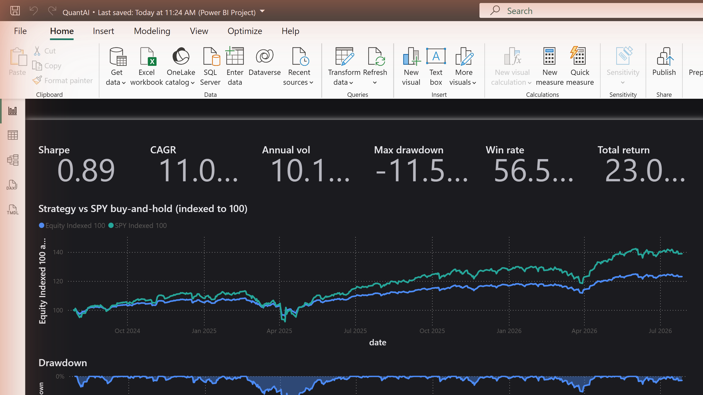
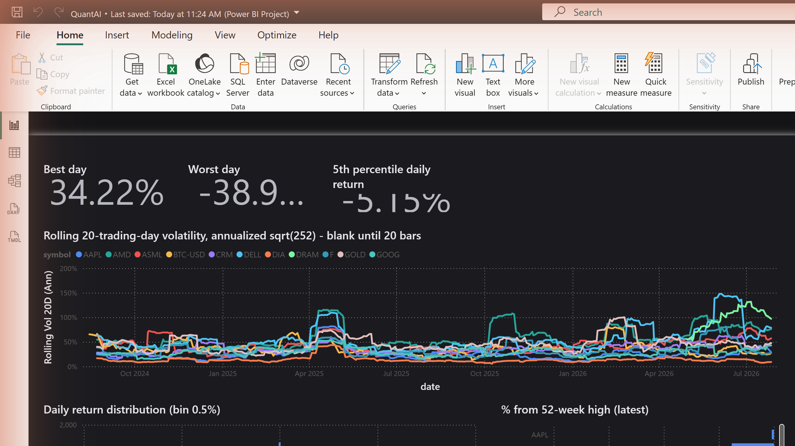
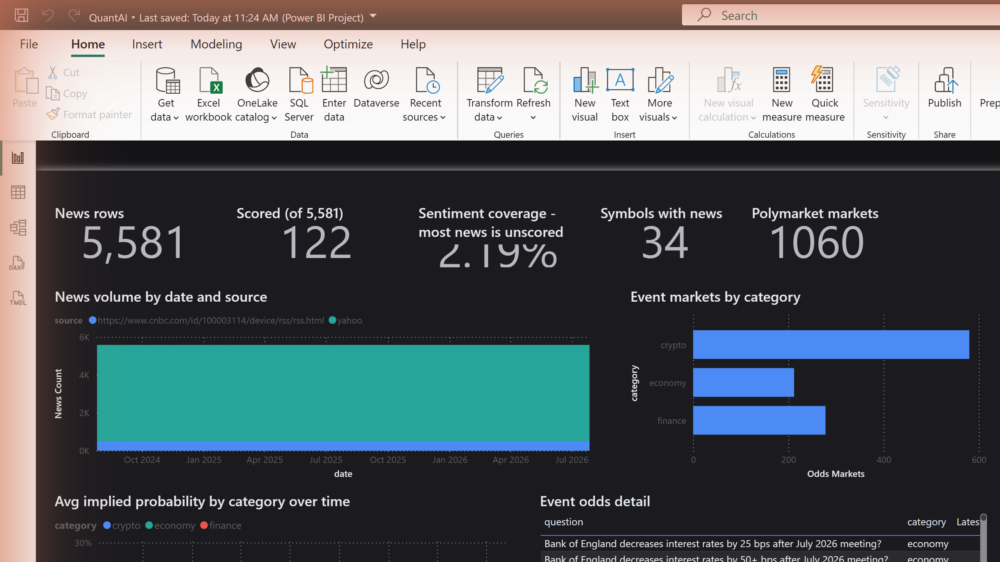
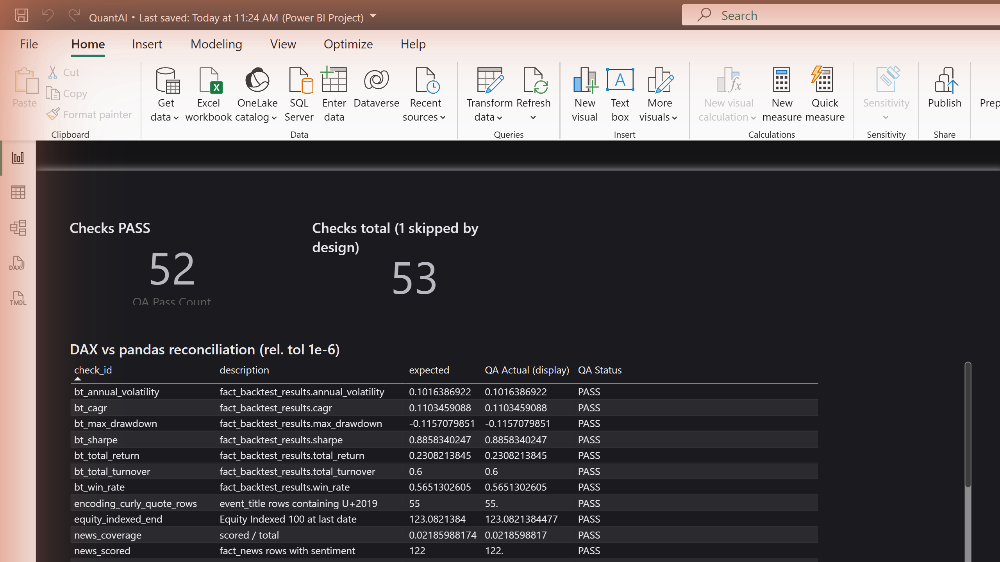

# QuantAI Portfolio Analytics — Power BI (BI as code)

A five-page (plus hidden QA) Power BI implementation of the dashboard
specification in [`../tableau/DASHBOARD_SPEC.md`](../tableau/DASHBOARD_SPEC.md),
over the CSV star schema exported from the QuantAI DuckDB warehouse.

This repo never contained a Tableau workbook — only the written spec. The work
here is the same class of migration as the repo's earlier T-SQL → Spark port:
**spec unchanged, engine swapped, results reconciled**. The semantic model is
plain-text TMDL and the report layout is generated by
[`build_report.py`](build_report.py) — the whole BI artifact diffs in git.

| Piece | File(s) |
|---|---|
| PBIP project entry | `QuantAI.pbip` (open in Power BI Desktop, free) |
| Semantic model (TMDL) | `QuantAI.SemanticModel/definition/**` — 10 tables, 11 relationships, all measures |
| Report layout (generated) | `QuantAI.Report/report.json` ← regenerate with `python powerbi/build_report.py` |
| Theme | `theme/quantai-dark.json` (#1B1B1F / #4C8BF5 / #26A69A / #EF5350) |
| Reconciliation | `verify/verify_dax.py` → `verify/expected_values.csv` (53 checks) |
| Screenshots | `img/page1…page6.png` |

## Open / refresh

1. `python scripts/warehouse.py --export` regenerates `tableau/exports/*.csv`
   (gitignored — the PBIP stores no data; open on a fresh machine requires this
   step first).
2. Open `QuantAI.pbip` in Power BI Desktop (free; Store build 2.156 verified).
   On another machine change the two Power Query parameters `ExportFolder` /
   `VerifyFolder` — every query reads through them.
3. Click **Refresh now** on the banner. CSV import is pinned to
   **65001 UTF-8** in every query; the QA page carries an encoding canary
   (55 `event_title` rows must contain the curly quote U+2019 — if that check
   fails, an import regressed to a legacy codepage).

Desktop will offer to save on close — saving re-serializes the hand-written
TMDL (comments are lost, `lineageTag`s added). Harmless, but for clean diffs
treat Desktop as read-only and let the text files be the source of truth.

## The technical core: Tableau table calcs → DAX

The spec's rolling measures are Tableau **table calculations** — they address
rows of the rendered view. DAX has no such concept; the window must be rebuilt
from the data. Three semantic points, each of which silently produces
plausible-but-wrong numbers if missed:

1. **The window is 20 trading rows, not 20 calendar days.** Translating
   `WINDOW_STDEV(..., -19, 0)` as `DATESINPERIOD(-20, DAY)` is the natural and
   wrong move. Measured on the current export (SPY, last date 2026-07-27): the
   20 trading rows span **28 calendar days**; a 20-calendar-day window keeps
   only **14 samples** and reads annualized vol **0.1016 vs 0.1132** — about
   **10% low**, with nothing visibly wrong on the chart. The DAX therefore
   takes `TOPN(20, …)` over the symbol's actual bar dates.
2. **`WINDOW_STDEV` is the sample standard deviation** → `STDEVX.S`
   (pandas `ddof=1`), not `STDEVX.P`.
3. **A short window returns BLANK** — `IF(COUNTROWS(w) = 20, …)` — matching
   Tableau's empty cell instead of quietly computing a 5-bar "volatility".

`MA 20/50/200` follow the same trading-row pattern; the benchmark-vs-strategy
lines are indexed to 100 anchored on the backtest calendar
(`fact_backtest_equity[date]`), so both series share the same 500-trading-day
axis.

## Verification: DAX vs pandas, 53 checks

`verify/verify_dax.py` computes every expected value from the same CSVs
(row counts ×10, SPY rolling vol and MA20/50/200 on the last five trading
days, both indexed series at range end, all seven backtest metrics, the four
latest-position numbers, the five signal-strength buckets, news sentiment
coverage, and the UTF-8 canary). The hidden **QA page** joins them against the
live DAX measures and verdicts each row at **relative tolerance 1e-6**.

Result on 2026-07-28: **52 / 53 PASS, 1 SKIPPED by design**
(`fact_trades.csv` has 0 rows and is deliberately not loaded). If a check
fails, the DAX is wrong — expected values may only change by re-running the
verify script against a fresh export.

Four DAX bugs were caught live by this loop (all in review-friendly history):

- a measure reference inside a `CALCULATE` boolean filter (`PLACEHOLDER`
  error) → capture with `VAR` first;
- `SELECTEDVALUE` returning BLANK on a single-row table in query context →
  `MAX` is the robust scalar for a 1-row table;
- `REMOVEFILTERS(t1, t2)` — multiple *table* arguments are not allowed →
  split into two calls;
- windowed measures going flat when the visual axis is a fact-table column
  that `ALLSELECTED(dim_date)` cannot see → anchor `CurDate`/`StartDate` on
  the axis table itself.

## Honest limitations

- **Free Desktop only**: no Publish-to-web / Service workspace, so the
  deliverable is the PBIP + screenshots; a reviewer reproduces by opening the
  project locally.
- The latest positions snapshot holds **one symbol (SPCX)** — the portfolio
  section is KPI cards, not weight charts; that is the data, not a rendering
  gap.
- `fact_news.sentiment` covers **122 of 5,581 rows (2.19%)** — the coverage is
  printed on the News page as a card, and no average is presented as a
  population statement.
- The close-price line defaults to all symbols (BTC-USD dominates the scale)
  — use the symbol slicer; per-visual default selections were left out of the
  generated layout.
- The signals matrix shows numbers without a diverging color scale, and the
  combo chart needs a single symbol selected to be readable (conditional
  formatting objects are not emitted by the generator yet).
- `is_trading_day` is a slicer, not a global filter — filtering it would drop
  BTC-USD's 231 weekend bars.
- Report layout uses the classic `report.json` format (stable, text,
  generator-friendly) rather than the PBIR preview format; the semantic model
  uses TMDL, which round-trips in Desktop 2.156 without preview switches.

## Screenshots

| Page | |
|---|---|
| Market Overview |  |
| Signals |  |
| Backtest vs Benchmark |  |
| Risk & Volatility |  |
| News & Event Odds |  |
| QA (hidden) |  |
